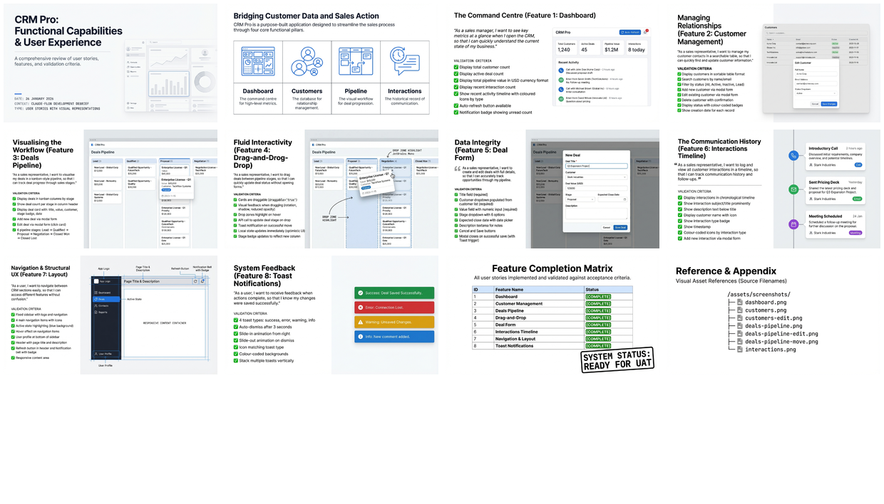

# CRM Pro: User Stories and Feature Capabilities

[🏠 Home](../../../../README.md) / [LinkedIn Published](../../../README.md) / [GenAI Development](../../README.md) / [CRM Hive-Mind Series](../README.md) / **User Stories and Features**

---

## Overview

This document provides comprehensive user story documentation for the CRM Pro application, describing all features from the end-user perspective with detailed acceptance criteria. Each of the 8 major features is documented using the standard user story format (As a / I want / So that) and includes ASCII art visual representations showing UI layouts, interaction flows, and component states.

---

## Infographic

---

## Slide Deck

*Click the mosaic to view the full 12-slide presentation*

---

## Semantic Knowledge Graph

For detailed concept relationships, entity definitions, and exportable graph data, see the **[Semantic Knowledge Graph](SEMANTIC-GRAPH.md)**.

---

## Source Information

| Attribute | Value |
|-----------|-------|
| **Source File** | [004-user-stories-and-features.md](004-user-stories-and-features.md) |
| **Document Type** | User Stories with Visual Representations |
| **Date** | January 26, 2026 |
| **Features Documented** | 8 major features |
| **Format** | User story format with ASCII art diagrams |
| **Technology Stack** | Express.js, TypeScript, Vanilla JS, In-Memory Storage |

---

## Feature Summary

| Feature | Description | Key Capabilities |
|---------|-------------|------------------|
| **Dashboard** | Main landing page with KPIs | Total customers, active deals, pipeline value, recent activity timeline |
| **Customer Management** | Contact database with CRUD operations | Search, filter by status, color-coded badges, modal forms |
| **Deals Pipeline** | Kanban-style board | 6 stages (Lead to Closed), deal cards with value/customer/date |
| **Drag-and-Drop** | Stage transition interaction | Visual feedback, optimistic UI updates, toast notifications |
| **Deal Forms** | Modal forms for deal creation/editing | Customer dropdown, value input, stage selection, date picker |
| **Interactions Timeline** | Activity history view | 4 interaction types (note, email, call, meeting), color-coded icons |
| **Navigation & Layout** | Application structure | Fixed sidebar, header with notifications, responsive content area |
| **Toast Notifications** | User feedback system | 4 types (success, error, warning, info), slide animations, auto-dismiss |

---

## Acceptance Criteria Highlights

### Dashboard
- Display total customer count, active deals, pipeline value in USD format
- Show recent activity timeline with color-coded icons
- Auto-refresh button and notification badge

### Customer Management
- Sortable table with search and status filtering
- Modal forms for add/edit operations
- Status badges: lead (blue), active (green), inactive (red)

### Deals Pipeline
- Kanban columns by stage with deal counts
- Deal cards showing title, value, customer, stage badge, date
- 6 stages: Lead, Qualified, Proposal, Negotiation, Closed Won, Closed Lost

### Drag-and-Drop
- Visual feedback during drag (rotation, shadow, opacity)
- Drop zone highlighting
- API call on drop with toast notification

### Interaction Types
- Note (gray #64748b) - Internal notes and reminders
- Email (green #10b981) - Email correspondence
- Call (blue #3b82f6) - Phone and video calls
- Meeting (amber #f59e0b) - In-person and video meetings

---

## Navigation

| Direction | Link |
|-----------|------|
| **Parent** | [CRM Hive-Mind Series](../README.md) |
| **Root** | [Home](../../../../README.md) |
| **Next** | [005 - Claude-Flow vs Claude Code](../005-claude-flow-vs-claude-code/README.md) |

---

*Part of the Claude-Flow CRM development documentation series.*
