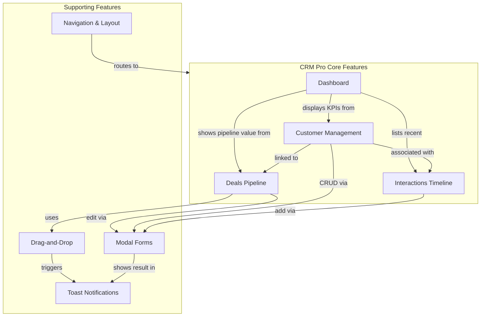
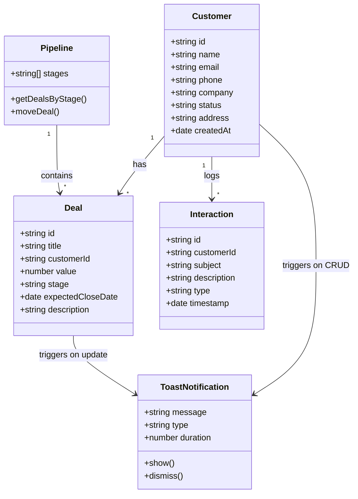
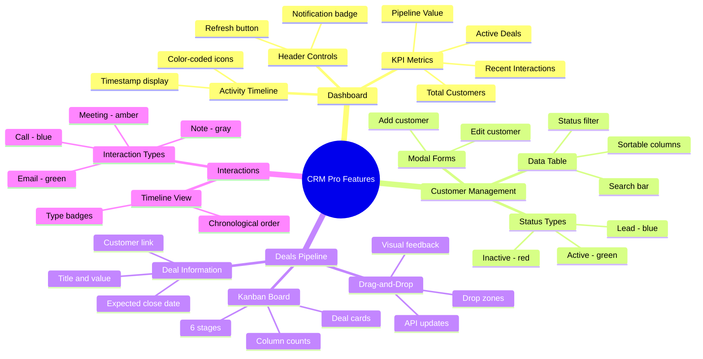
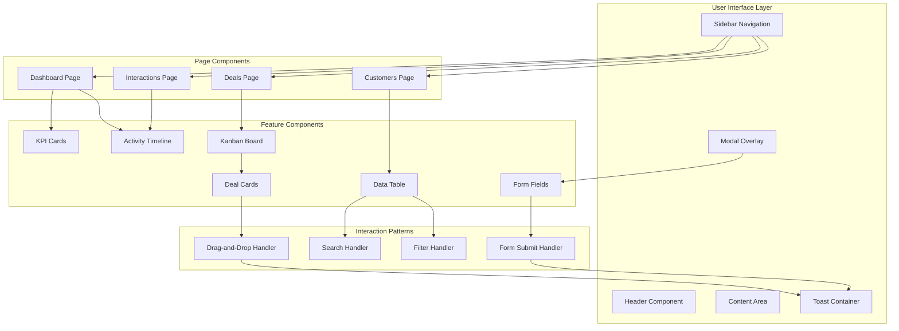

# Semantic Knowledge Graph: CRM Pro User Stories and Features

[🏠 Home](../../../../README.md) / [LinkedIn Published](../../../README.md) / [GenAI Development](../../README.md) / [CRM Hive-Mind Series](../README.md) / [User Stories and Features](./README.md) / **Semantic Graph**

---

## Summary

This document captures user-centered feature specifications for CRM Pro, defining 8 core application features through the user story methodology. Each feature includes detailed acceptance criteria and ASCII art visualizations demonstrating UI layouts, interaction patterns, and component states. The documentation covers the complete sales workflow from dashboard overview through customer management, deals pipeline with drag-and-drop functionality, and interaction tracking with toast notification feedback.

---

## Key Concepts

| Concept | Definition |
|---------|------------|
| **User Story Format** | Structured requirement template using "As a [role], I want [feature], So that [benefit]" to capture user-centric functionality |
| **Kanban Pipeline** | Visual workflow representation with 6 sequential columns (Lead, Qualified, Proposal, Negotiation, Closed Won, Closed Lost) for tracking deal progression |
| **Drag-and-Drop Flow** | Browser interaction pattern using dragstart, dragover, drop, and dragend events with visual feedback and optimistic UI updates |
| **Modal Form Pattern** | Overlay dialog component for create/edit operations with form validation, cancel/save actions, and toast notification on completion |
| **Color-Coded Interaction Types** | Four distinct interaction categories (note, email, call, meeting) each with unique icon and color for visual differentiation |
| **Toast Notification System** | Temporary feedback messages with 4 types (success, error, warning, info), slide animation, and 3-second auto-dismiss behavior |

---

## Core Arguments

1. **User-Centered Design**: The user story format ensures features are defined from the end-user perspective, connecting functionality to specific user roles (sales manager, sales representative) and their business goals rather than technical implementation details.

2. **Visual Workflow Management**: The kanban-style deals pipeline provides immediate visual comprehension of sales funnel status, with deal cards displaying key information (value, customer, stage) and column headers showing aggregate counts.

3. **Immediate Interaction Feedback**: Drag-and-drop functionality combined with toast notifications creates a responsive user experience where stage changes are reflected instantly through optimistic UI updates before API confirmation.

4. **Consistent Component Patterns**: Modal forms for customers and deals follow identical patterns (required field marking, dropdown selects, cancel/save buttons), establishing predictable interaction models throughout the application.

5. **Activity-Centric Tracking**: The interactions timeline with color-coded types enables comprehensive communication history tracking, supporting sales representatives in maintaining context across customer touchpoints.

6. **Structured Navigation Architecture**: Fixed sidebar with four main sections (Dashboard, Customers, Deals, Interactions) combined with visual state indicators (hover, active) provides clear wayfinding throughout the application.

---

## Tags

`user-stories` `crm` `kanban` `deals-pipeline` `drag-and-drop` `customer-management` `interaction-tracking` `toast-notifications` `modal-forms` `ascii-art` `acceptance-criteria` `sales-workflow` `ui-patterns` `feature-specification` `express-js`

---

## Mermaid Diagrams

### Feature Relationship Flow



### Entity Class Diagram



### User Story Concept Map



### Application Architecture



---

## Cypher Export

```cypher
// CRM Pro User Stories and Features - Knowledge Graph Export

// Create Feature Nodes
CREATE (f1:Feature {id: 'dashboard', name: 'Dashboard', description: 'Main landing page with KPIs and activity timeline', userRole: 'sales_manager'})
CREATE (f2:Feature {id: 'customer_mgmt', name: 'Customer Management', description: 'Contact database with CRUD operations', userRole: 'sales_representative'})
CREATE (f3:Feature {id: 'deals_pipeline', name: 'Deals Pipeline', description: 'Kanban-style board with 6 stages', userRole: 'sales_representative'})
CREATE (f4:Feature {id: 'drag_drop', name: 'Drag-and-Drop', description: 'Stage transition interaction with visual feedback', userRole: 'sales_representative'})
CREATE (f5:Feature {id: 'deal_forms', name: 'Deal Forms', description: 'Modal forms for deal creation and editing', userRole: 'sales_representative'})
CREATE (f6:Feature {id: 'interactions', name: 'Interactions Timeline', description: 'Activity history with color-coded types', userRole: 'sales_representative'})
CREATE (f7:Feature {id: 'navigation', name: 'Navigation and Layout', description: 'Application structure with sidebar and header', userRole: 'user'})
CREATE (f8:Feature {id: 'toast', name: 'Toast Notifications', description: 'User feedback system with 4 types', userRole: 'user'})

// Create Entity Nodes
CREATE (e1:Entity {id: 'customer', name: 'Customer', properties: 'id, name, email, phone, company, status, address, createdAt'})
CREATE (e2:Entity {id: 'deal', name: 'Deal', properties: 'id, title, customerId, value, stage, expectedCloseDate, description'})
CREATE (e3:Entity {id: 'interaction', name: 'Interaction', properties: 'id, customerId, subject, description, type, timestamp'})

// Create Component Nodes
CREATE (c1:Component {id: 'sidebar', name: 'Sidebar', width: '260px', position: 'fixed'})
CREATE (c2:Component {id: 'header', name: 'Header', elements: 'title, description, refresh, notifications'})
CREATE (c3:Component {id: 'modal', name: 'Modal Form', pattern: 'overlay_dialog'})
CREATE (c4:Component {id: 'kanban', name: 'Kanban Board', columns: 6})
CREATE (c5:Component {id: 'toast_container', name: 'Toast Container', position: 'top_right'})

// Create Stage Nodes
CREATE (s1:Stage {id: 'lead', name: 'Lead', order: 1})
CREATE (s2:Stage {id: 'qualified', name: 'Qualified', order: 2})
CREATE (s3:Stage {id: 'proposal', name: 'Proposal', order: 3})
CREATE (s4:Stage {id: 'negotiation', name: 'Negotiation', order: 4})
CREATE (s5:Stage {id: 'closed_won', name: 'Closed Won', order: 5})
CREATE (s6:Stage {id: 'closed_lost', name: 'Closed Lost', order: 6})

// Create Interaction Type Nodes
CREATE (it1:InteractionType {id: 'note', name: 'Note', color: '#64748b', icon: 'document'})
CREATE (it2:InteractionType {id: 'email', name: 'Email', color: '#10b981', icon: 'envelope'})
CREATE (it3:InteractionType {id: 'call', name: 'Call', color: '#3b82f6', icon: 'phone'})
CREATE (it4:InteractionType {id: 'meeting', name: 'Meeting', color: '#f59e0b', icon: 'calendar'})

// Create Status Nodes
CREATE (st1:CustomerStatus {id: 'lead', name: 'Lead', color: 'blue'})
CREATE (st2:CustomerStatus {id: 'active', name: 'Active', color: 'green'})
CREATE (st3:CustomerStatus {id: 'inactive', name: 'Inactive', color: 'red'})

// Create Toast Type Nodes
CREATE (tt1:ToastType {id: 'success', name: 'Success', color: 'green', icon: 'checkmark'})
CREATE (tt2:ToastType {id: 'error', name: 'Error', color: 'red', icon: 'x'})
CREATE (tt3:ToastType {id: 'warning', name: 'Warning', color: 'yellow', icon: 'exclamation'})
CREATE (tt4:ToastType {id: 'info', name: 'Info', color: 'blue', icon: 'i'})

// Create Feature Relationships
CREATE (f1)-[:DISPLAYS_DATA_FROM]->(e1)
CREATE (f1)-[:DISPLAYS_DATA_FROM]->(e2)
CREATE (f1)-[:DISPLAYS_DATA_FROM]->(e3)
CREATE (f2)-[:MANAGES]->(e1)
CREATE (f3)-[:MANAGES]->(e2)
CREATE (f3)-[:USES_COMPONENT]->(c4)
CREATE (f3)-[:USES]->(f4)
CREATE (f4)-[:TRIGGERS]->(f8)
CREATE (f5)-[:USES_COMPONENT]->(c3)
CREATE (f5)-[:TRIGGERS]->(f8)
CREATE (f6)-[:MANAGES]->(e3)
CREATE (f7)-[:USES_COMPONENT]->(c1)
CREATE (f7)-[:USES_COMPONENT]->(c2)
CREATE (f8)-[:USES_COMPONENT]->(c5)

// Create Entity Relationships
CREATE (e1)-[:HAS_MANY]->(e2)
CREATE (e1)-[:HAS_MANY]->(e3)
CREATE (e2)-[:BELONGS_TO]->(e1)
CREATE (e3)-[:BELONGS_TO]->(e1)

// Create Stage Flow
CREATE (s1)-[:PROGRESSES_TO]->(s2)
CREATE (s2)-[:PROGRESSES_TO]->(s3)
CREATE (s3)-[:PROGRESSES_TO]->(s4)
CREATE (s4)-[:PROGRESSES_TO]->(s5)
CREATE (s4)-[:PROGRESSES_TO]->(s6)

// Create Type Associations
CREATE (e3)-[:CAN_BE_TYPE]->(it1)
CREATE (e3)-[:CAN_BE_TYPE]->(it2)
CREATE (e3)-[:CAN_BE_TYPE]->(it3)
CREATE (e3)-[:CAN_BE_TYPE]->(it4)
CREATE (e1)-[:HAS_STATUS]->(st1)
CREATE (e1)-[:HAS_STATUS]->(st2)
CREATE (e1)-[:HAS_STATUS]->(st3)
CREATE (f8)-[:HAS_TYPE]->(tt1)
CREATE (f8)-[:HAS_TYPE]->(tt2)
CREATE (f8)-[:HAS_TYPE]->(tt3)
CREATE (f8)-[:HAS_TYPE]->(tt4)
CREATE (e2)-[:HAS_STAGE]->(s1)
CREATE (e2)-[:HAS_STAGE]->(s2)
CREATE (e2)-[:HAS_STAGE]->(s3)
CREATE (e2)-[:HAS_STAGE]->(s4)
CREATE (e2)-[:HAS_STAGE]->(s5)
CREATE (e2)-[:HAS_STAGE]->(s6)

// Create Document Node
CREATE (doc:Document {
  id: '004-user-stories-and-features',
  title: 'CRM Pro: User Stories and Feature Capabilities',
  date: '2026-01-26',
  type: 'User Stories with Visual Representations',
  featureCount: 8,
  techStack: 'Express.js, TypeScript, Vanilla JS, In-Memory Storage'
})

// Link Document to Features
CREATE (doc)-[:DOCUMENTS]->(f1)
CREATE (doc)-[:DOCUMENTS]->(f2)
CREATE (doc)-[:DOCUMENTS]->(f3)
CREATE (doc)-[:DOCUMENTS]->(f4)
CREATE (doc)-[:DOCUMENTS]->(f5)
CREATE (doc)-[:DOCUMENTS]->(f6)
CREATE (doc)-[:DOCUMENTS]->(f7)
CREATE (doc)-[:DOCUMENTS]->(f8)
```

---

*Part of the Claude-Flow CRM semantic documentation series.*
