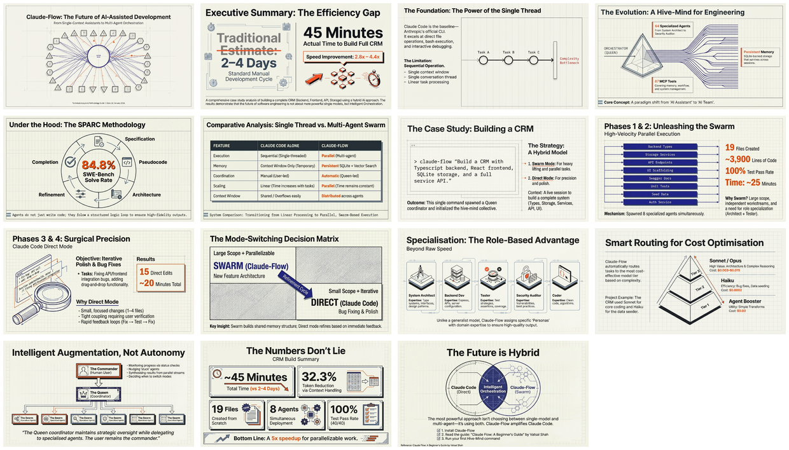

# Claude-Flow vs Claude Code: From AI Assistant to AI Team

[🏠 Home](../../../../README.md) / [LinkedIn Published](../../../README.md) / [GenAI Development](../../README.md) / [CRM Hive-Mind Series](../README.md) / **Claude-Flow vs Claude Code**

---

## Overview

This analysis examines the paradigm shift from single-model AI assistance (Claude Code) to multi-agent orchestration (Claude-Flow). Through a real CRM development case study, it demonstrates that the optimal approach combines both: **swarm mode** for parallel large-scale development and **direct mode** for precise iterative fixes. The result is a "best of both worlds" methodology that completed a full CRM system in 45 minutes versus an estimated 2-4 days using traditional approaches.

---

## Infographic


---

## Slide Deck

[](Claude-Flow_Multi-Agent_Development.pdf)

*Click the mosaic above to view the full 15-slide presentation*

---

## Semantic Knowledge Graph

For detailed concept mapping, relationships, and exportable graph data, see:

**[SEMANTIC-GRAPH.md](SEMANTIC-GRAPH.md)**

Contents:
- Key Concepts and Definitions
- Core Arguments and Evidence
- Mermaid Diagrams (Architecture, Relationships, Decision Flows)
- Cypher Export for Neo4j

---

## Source Information

| Attribute | Details |
|-----------|---------|
| **Source Document** | [005-claude-flow-vs-claude-code.md](005-claude-flow-vs-claude-code.md) |
| **Document Type** | Technical Analysis and Methodology Guide |
| **Date** | January 26, 2026 |
| **Infographic** | [26 Jan - Claude-Flow - From AI Assistant to Team.jpg](26%20Jan%20-%20Claude-Flow%20-%20From%20AI%20Assistant%20to%20Team.jpg) |
| **Slide Deck** | [Claude-Flow_Multi-Agent_Development.pdf](Claude-Flow_Multi-Agent_Development.pdf) (15 slides) |
| **Slide Mosaic** | [slides_mosaic.png](slides_mosaic.png) |
| **Reference Guide** | [Claude Flow: A Beginner's Guide](https://vatsalshah.in/blog/claude-flow-beginners-guide) by Vatsal Shah |

---

## Key Highlights

### The Paradigm Shift

| Aspect | Claude Code (Single Model) | Claude-Flow (Multi-Agent) |
|--------|---------------------------|---------------------------|
| Execution | Sequential, single-threaded | Parallel, multi-agent |
| Memory | Conversation context only | Persistent SQLite + vector search |
| Specialization | General-purpose | 64 specialized agent types |
| Coordination | Manual by user | Automatic via Queen coordinator |
| Best For | Quick fixes, debugging | Large features, parallel work |

### Performance Metrics

- **SWE-Bench Solve Rate**: 84.8%
- **Token Reduction**: 32.3%
- **Speed Improvement**: 2.8-4.4x through parallel coordination

### CRM Project Results

| Phase | Time | Mode |
|-------|------|------|
| Backend (types, storage, services, API, tests) | ~10 min | Swarm (5 agents) |
| Frontend (UI, Swagger, seed data) | ~15 min | Swarm (3 agents) |
| Bug fixes | ~10 min | Direct |
| Drag-and-drop feature | ~10 min | Direct |
| **Total** | **~45 min** | Both |

### The Decision Matrix

**Use Swarm Mode when:**
- Large scope (10+ files)
- Independent workstreams
- Specialized expertise needed
- New feature implementation

**Use Direct Mode when:**
- Small, focused changes (1-4 files)
- Iterative debugging required
- User feedback needed
- Tight coupling between changes

---

## Quick Start

```bash
# Install Claude-Flow
npm install -g claude-flow@alpha

# Initialize in your project
npx claude-flow@alpha init --force

# Spawn the hive-mind
npx claude-flow@alpha hive-mind spawn "Your vision here" --claude
```

---

## Navigation

| Direction | Link |
|-----------|------|
| **Parent** | [CRM Hive-Mind Series](../README.md) |
| **Root** | [Home](../../../../README.md) |
| **Previous** | [004 - User Stories and Features](../004-user-stories-and-features/README.md) |
| **Next** | [006 - Docker Environment Design](../006-docker-environment-design/README.md) |
