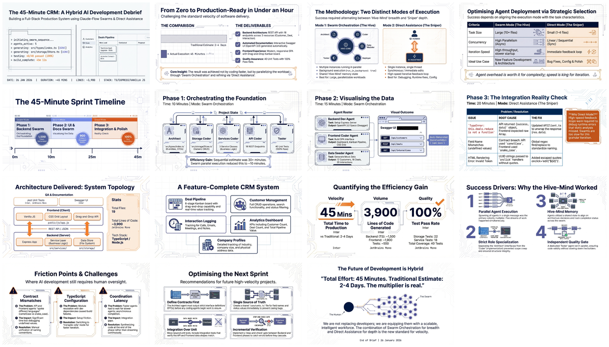

# CRM Development Debrief

[🏠 Home](../../../../../README.md) / [LinkedIn Published](../../../../README.md) / [GenAI Development](../../../README.md) / [Claude Flow](../../README.md) / [CRM Hive-Mind Series](../README.md) / **CRM Development Debrief**

---

## Overview

Comprehensive debrief documenting full-stack CRM development using a hybrid AI approach. The project combined parallel swarm orchestration for large-scale features with direct AI assistance for iterative fixes and debugging. The result: 19 files, approximately 3,900 lines of code, and 40 passing tests, all completed in roughly 45 minutes.

The methodology demonstrated two distinct execution modes: **Swarm Mode** using Claude-Flow's hive-mind architecture with hierarchical topology (Queen coordinator with specialized agents), and **Direct Mode** using Claude Code for rapid iteration on bug fixes and small enhancements.

---

## Infographic

---

## Slides

*Click the mosaic to view the full 15-slide presentation*

---

## Semantic Knowledge Graph

For detailed concept mapping, arguments, and machine-readable graph exports, see:

**[SEMANTIC-GRAPH.md](SEMANTIC-GRAPH.md)**

---

## Source Information

| Property | Value |
|----------|-------|
| **Source File** | [001-crm-development-debrief.md](001-crm-development-debrief.md) |
| **Date** | January 26, 2026 |
| **Topic Area** | GenAI Development / Dev Tools / Claude-Flow |
| **Content Type** | Development Debrief |
| **Infographic** | 26 Jan - The 45-Minute CRM Methodology.jpg |
| **Slides** | 26 Jan - Velocity_Swarm_45_Minute_CRM_Build.pdf (15 slides) |
| **Key Metrics** | 45 min development, 19 files, ~3,900 LOC, 40 tests |

---

## Key Highlights

- **Hybrid Methodology**: Combined swarm orchestration for parallel development with direct AI for iterative fixes
- **Hierarchical Swarm Topology**: Queen coordinator managing specialized agents (Architect, Coders, Tester)
- **Two Execution Modes**: Swarm Mode for large parallelizable tasks, Direct Mode for rapid debugging
- **Complete Deliverables**: REST API (18 endpoints), Swagger UI, modern web dashboard, drag-and-drop pipeline
- **Decision Framework**: Clear matrix for selecting between swarm and direct execution based on task characteristics

---

## Navigation

| Direction | Link |
|-----------|------|
| Parent | [CRM Hive-Mind Series](../README.md) |
| Root | [Home](../../../../../README.md) |
