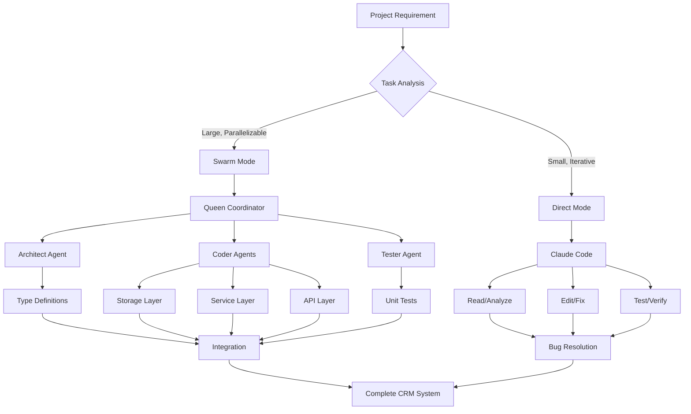
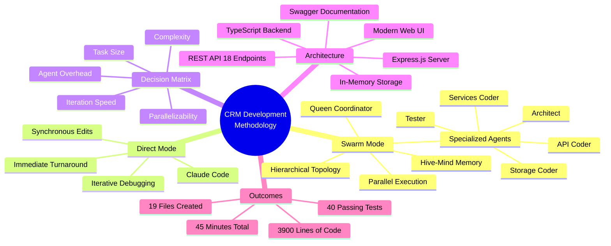
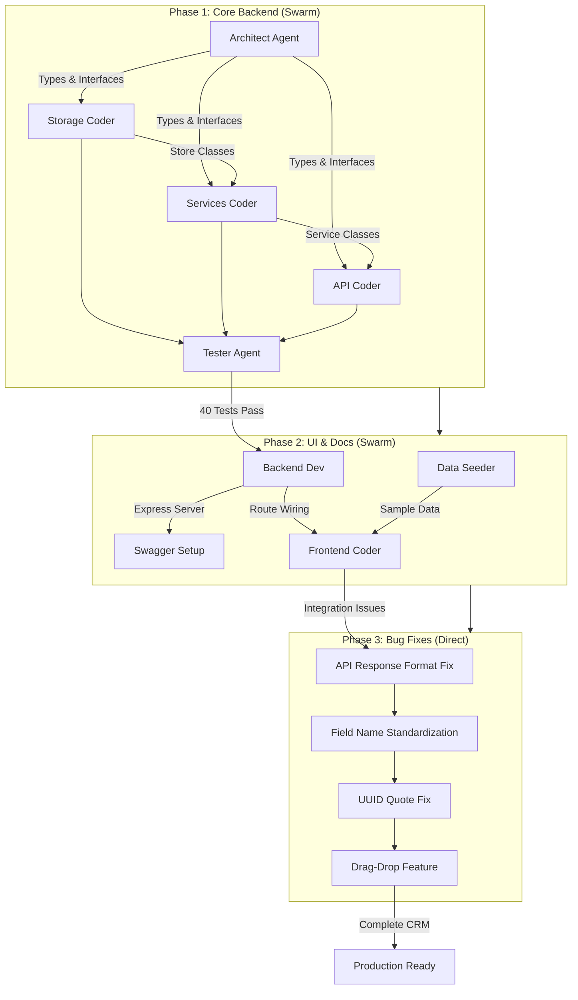

[🏠 Home](../../../../../README.md) / [LinkedIn Published](../../../../README.md) / [GenAI Development](../../../README.md) / [Claude Flow](../../README.md) / [CRM Hive-Mind Series](../README.md) / [CRM Development Debrief](./README.md) / **Semantic Graph**

# Semantic Knowledge Graph: CRM Development Debrief

---

## Summary

This debrief documents the development of a full-stack CRM system in approximately 45 minutes using a hybrid AI approach that combines parallel swarm orchestration with direct AI assistance. The project deployed a hierarchical swarm topology with a Queen coordinator managing specialized agents (Architect, Coders, Tester) for large-scale parallel development, while using direct Claude Code execution for rapid iterative bug fixes. The methodology produced 19 files with ~3,900 lines of code and achieved 100% pass rate on 40 unit tests, demonstrating that the right combination of execution modes can compress multi-day development efforts into under an hour.

---

## Key Concepts

1. **Hierarchical Swarm Topology**: A multi-agent architecture where a Queen coordinator manages strategic planning while specialized agents (Architect, Storage Coder, Services Coder, API Coder, Tester) execute parallel workstreams with shared hive-mind memory.

2. **Hybrid AI Development**: A methodology combining two execution modes—Swarm Mode for large parallelizable features and Direct Mode for iterative fixes—selecting the appropriate approach based on task characteristics like size, complexity, and parallelizability.

3. **Decision Matrix for Mode Selection**: A framework evaluating criteria (task size, parallelizability, iteration speed, complexity, agent overhead) to determine whether swarm orchestration or direct assistance is more efficient for a given task.

4. **In-Memory Storage Architecture**: A lightweight data persistence layer using generic CRUD store classes that maintain separate stores for customers, deals, contacts, and interactions without external database dependencies.

5. **Specialized Agent Roles**: Distinct agent types with focused responsibilities—System Architect for type definitions, Coders for implementation across layers, and Tester for quality assurance—enabling parallel execution without conflicts.

6. **API/Frontend Contract Standardization**: The practice of defining consistent interfaces and response wrappers in an APIClient layer to resolve mismatches between backend naming conventions (camelCase) and frontend expectations.

---

## Core Arguments

1. **Parallel Execution Dramatically Reduces Development Time**: By spawning five specialized agents in a single message executing in parallel, the backend was completed in ~10 minutes versus an estimated 30+ minutes for sequential execution, demonstrating that multi-agent coordination can achieve significant time compression.

2. **Swarm and Direct Modes Serve Different Task Profiles**: Swarm mode excels at large, parallelizable workloads requiring 10+ files and high complexity, while direct mode is optimal for small fixes involving 1-4 files where agent spawn overhead is not justified.

3. **Specialized Agent Roles Improve Output Quality**: Having a dedicated Architect agent define type interfaces before coders begin ensures consistent contracts across the system, while a dedicated Tester agent catches issues early in the development cycle.

4. **Hybrid Methodology Matches Tools to Tasks**: The combination of swarm orchestration for feature development and direct AI for debugging applies the right tool for each job, achieving both the parallelism benefits of multi-agent systems and the rapid iteration benefits of single-instance execution.

5. **Contract-First Design Prevents Integration Issues**: Challenges encountered (API/frontend mismatches, naming convention differences) suggest that defining interfaces, shared constants, and response formats before implementation would reduce debugging time in the fix phase.

6. **Traditional Development Estimates Can Be Compressed**: The project delivered production-quality software (18 REST endpoints, Swagger documentation, responsive UI, 40 passing tests) in 45 minutes versus a traditional estimate of 2-4 days, validating the productivity gains of AI-assisted development.

---

## Tags

`swarm-orchestration` `multi-agent-systems` `claude-flow` `hive-mind` `hierarchical-topology` `parallel-development` `hybrid-methodology` `crm-system` `typescript` `express-js` `full-stack-development` `ai-assisted-development` `agent-coordination` `in-memory-storage` `rapid-prototyping`

---

## Mermaid Diagrams

### Development Methodology Flow



### System Architecture Class Diagram

```classDiagram
    class QueenCoordinator {
        +strategicPlanning()
        +coordinateAgents()
        +manageHiveMemory()
    }

    class ArchitectAgent {
        +defineTypes()
        +createInterfaces()
        +establishContracts()
    }

    class CoderAgent {
        +implementStorage()
        +buildServices()
        +createAPIEndpoints()
    }

    class TesterAgent {
        +writeUnitTests()
        +validateCoverage()
        +reportResults()
    }

    class Store {
        +create()
        +read()
        +update()
        +delete()
        +search()
    }

    class CustomerService {
        +createCustomer()
        +getCustomer()
        +updateCustomer()
        +searchCustomers()
    }

    class DealService {
        +createDeal()
        +updateStage()
        +getPipeline()
        +calculateValue()
    }

    class InteractionService {
        +logInteraction()
        +getHistory()
        +filterByType()
    }

    QueenCoordinator --> ArchitectAgent
    QueenCoordinator --> CoderAgent
    QueenCoordinator --> TesterAgent

    CoderAgent --> Store
    CoderAgent --> CustomerService
    CoderAgent --> DealService
    CoderAgent --> InteractionService

    CustomerService --> Store
    DealService --> Store
    InteractionService --> Store
```

### Concept Mind Map



### Development Phase Dependencies



---

## Cypher Export

```cypher
// Nodes: Core Concepts
CREATE (methodology:Concept {name: "Hybrid AI Development", description: "Methodology combining swarm orchestration for parallel features with direct AI for iterative fixes"})
CREATE (swarmMode:Concept {name: "Swarm Mode", description: "Multi-agent parallel execution using Claude-Flow hive-mind architecture"})
CREATE (directMode:Concept {name: "Direct Mode", description: "Single Claude instance for synchronous edits and rapid iteration"})
CREATE (hierarchicalTopology:Concept {name: "Hierarchical Swarm Topology", description: "Queen coordinator managing specialized agents with shared memory"})
CREATE (decisionMatrix:Concept {name: "Decision Matrix", description: "Framework for selecting execution mode based on task characteristics"})
CREATE (inMemoryStorage:Concept {name: "In-Memory Storage", description: "Generic CRUD store classes without external database dependencies"})

// Nodes: Agents
CREATE (queen:Agent {name: "Queen Coordinator", role: "Strategic planning and agent coordination"})
CREATE (architect:Agent {name: "Architect Agent", role: "Type definitions and interface contracts"})
CREATE (storageCoder:Agent {name: "Storage Coder", role: "Data layer implementation"})
CREATE (servicesCoder:Agent {name: "Services Coder", role: "Business logic implementation"})
CREATE (apiCoder:Agent {name: "API Coder", role: "REST endpoint implementation"})
CREATE (tester:Agent {name: "Tester Agent", role: "Unit test development and quality assurance"})

// Nodes: Deliverables
CREATE (types:Deliverable {name: "Type Definitions", file: "src/types/index.ts", lines: 129})
CREATE (storage:Deliverable {name: "Storage Layer", files: "Store.ts, index.ts", lines: 116})
CREATE (services:Deliverable {name: "Service Layer", files: "CustomerService.ts, DealService.ts, InteractionService.ts"})
CREATE (api:Deliverable {name: "REST API", endpoints: 18, files: "customers.ts, deals.ts, interactions.ts"})
CREATE (tests:Deliverable {name: "Unit Tests", count: 40, passRate: "100%"})
CREATE (ui:Deliverable {name: "Web UI", type: "SPA", features: "Dashboard, Pipeline, Drag-Drop"})
CREATE (swagger:Deliverable {name: "Swagger Documentation", path: "/api-docs", spec: "OpenAPI 3.0"})

// Nodes: Phases
CREATE (phase1:Phase {name: "Phase 1: Core Backend", mode: "Swarm", duration: "10 minutes"})
CREATE (phase2:Phase {name: "Phase 2: UI & Documentation", mode: "Swarm", duration: "15 minutes"})
CREATE (phase3:Phase {name: "Phase 3: Bug Fixes", mode: "Direct", duration: "20 minutes"})

// Nodes: Metrics
CREATE (metrics:Metrics {totalTime: "45 minutes", files: 19, linesOfCode: 3900, tests: 40, endpoints: 18})

// Relationships: Methodology Structure
CREATE (methodology)-[:INCLUDES]->(swarmMode)
CREATE (methodology)-[:INCLUDES]->(directMode)
CREATE (methodology)-[:USES]->(decisionMatrix)
CREATE (swarmMode)-[:IMPLEMENTS]->(hierarchicalTopology)
CREATE (hierarchicalTopology)-[:HAS_COORDINATOR]->(queen)

// Relationships: Agent Hierarchy
CREATE (queen)-[:COORDINATES]->(architect)
CREATE (queen)-[:COORDINATES]->(storageCoder)
CREATE (queen)-[:COORDINATES]->(servicesCoder)
CREATE (queen)-[:COORDINATES]->(apiCoder)
CREATE (queen)-[:COORDINATES]->(tester)

// Relationships: Agent Outputs
CREATE (architect)-[:PRODUCES]->(types)
CREATE (storageCoder)-[:PRODUCES]->(storage)
CREATE (servicesCoder)-[:PRODUCES]->(services)
CREATE (apiCoder)-[:PRODUCES]->(api)
CREATE (tester)-[:PRODUCES]->(tests)

// Relationships: Phase Execution
CREATE (phase1)-[:USES_MODE]->(swarmMode)
CREATE (phase2)-[:USES_MODE]->(swarmMode)
CREATE (phase3)-[:USES_MODE]->(directMode)
CREATE (phase1)-[:PRODUCES]->(types)
CREATE (phase1)-[:PRODUCES]->(storage)
CREATE (phase1)-[:PRODUCES]->(services)
CREATE (phase1)-[:PRODUCES]->(api)
CREATE (phase1)-[:PRODUCES]->(tests)
CREATE (phase2)-[:PRODUCES]->(ui)
CREATE (phase2)-[:PRODUCES]->(swagger)

// Relationships: Dependencies
CREATE (types)-[:REQUIRED_BY]->(storage)
CREATE (storage)-[:REQUIRED_BY]->(services)
CREATE (services)-[:REQUIRED_BY]->(api)
CREATE (api)-[:VALIDATED_BY]->(tests)
CREATE (phase1)-[:PRECEDES]->(phase2)
CREATE (phase2)-[:PRECEDES]->(phase3)

// Relationships: Architecture
CREATE (storage)-[:USES]->(inMemoryStorage)
CREATE (services)-[:DEPENDS_ON]->(storage)
CREATE (api)-[:EXPOSES]->(services)
CREATE (ui)-[:CONSUMES]->(api)
CREATE (swagger)-[:DOCUMENTS]->(api)

// Relationships: Decision Criteria
CREATE (decisionMatrix)-[:EVALUATES {criterion: "Task Size"}]->(swarmMode)
CREATE (decisionMatrix)-[:EVALUATES {criterion: "Parallelizability"}]->(swarmMode)
CREATE (decisionMatrix)-[:EVALUATES {criterion: "Iteration Speed"}]->(directMode)
CREATE (decisionMatrix)-[:EVALUATES {criterion: "Complexity"}]->(swarmMode)
CREATE (decisionMatrix)-[:EVALUATES {criterion: "Agent Overhead"}]->(directMode)
```

---

*Generated from source: [001-crm-development-debrief.md](001-crm-development-debrief.md)*
