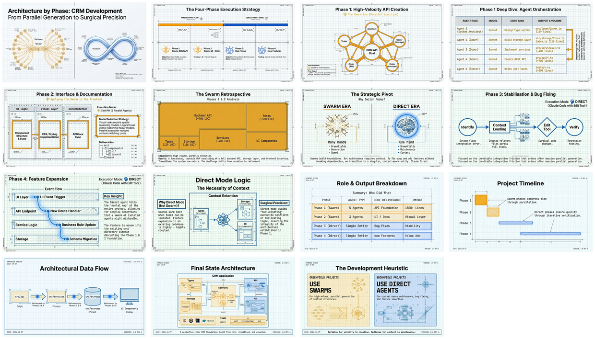

# Architecture by Phase

[🏠 Home](../../../../../README.md) / [LinkedIn Published](../../../../README.md) / [GenAI Development](../../../README.md) / [Claude Flow](../../README.md) / [CRM Hive-Mind Series](../README.md) / **Architecture by Phase**

---

## Overview

Technical architecture diagrams documenting the four development phases of a CRM system built with Claude-Flow. This resource visualizes the strategic shift between swarm execution (Phases 1-2) and direct mode (Phases 3-4), demonstrating when parallel agent coordination provides maximum value versus when focused single-instance development is more effective.

---

## Infographic

---

## Slide Mosaic

*Click the mosaic above to open the full 15-slide presentation*

---

## Semantic Knowledge Graph

For detailed concept mapping, relationships, and exportable graph data, see:

**[SEMANTIC-GRAPH.md](SEMANTIC-GRAPH.md)**

Contents:
- Key concepts and core arguments
- Mermaid diagrams (flowchart, class diagram, mindmap, knowledge graph)
- Cypher export for Neo4j
- Comprehensive tagging

---

## Source Information

| Property | Value |
|----------|-------|
| **Source File** | [003-architecture-by-phase.md](003-architecture-by-phase.md) |
| **Document Type** | Technical Architecture and Workflow Diagrams |
| **Date** | January 26, 2026 |
| **Infographic** | 26 Jan - CRM Development AI Architecture Phases.jpg |
| **Presentation** | Swarm_to_Direct_An_AI_Development_Journey.pdf (15 slides) |
| **Mosaic** | slides_mosaic.png |

---

## Phase Summary

| Phase | Objective | Execution Mode | Agents | Duration | Output |
|-------|-----------|----------------|--------|----------|--------|
| **Phase 1** | Create CRM API | Claude-Flow Swarm | 5 parallel | ~10 min | Types, Storage, Services, API, Tests |
| **Phase 2** | UI + API Docs | Claude-Flow Swarm | 3 parallel | ~15 min | Server, Frontend, Seed Data |
| **Phase 3** | Bug Fixing | Claude Direct | 1 instance | ~10 min | API format fixes, naming conventions |
| **Phase 4** | New Features | Claude Direct | 1 instance | ~10 min | Drag-and-drop pipeline |

---

## Key Architectural Decisions

### When to Use Swarm Mode
- Greenfield development with parallel work opportunities
- 10+ files requiring modification
- Independent task decomposition possible
- Complex multi-component systems

### When to Use Direct Mode
- Bug fixes requiring immediate feedback loops
- Small features affecting fewer than 10 files
- Sequential dependencies between changes
- Iteration expected during development

---

## Navigation

| Direction | Link |
|-----------|------|
| Parent | [CRM Hive-Mind Series](../README.md) |
| Root | [Home](../../../../../README.md) |
