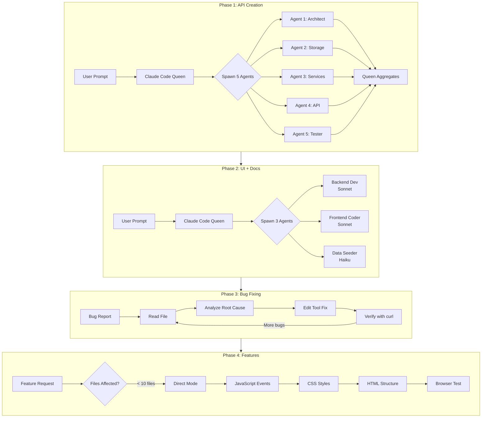
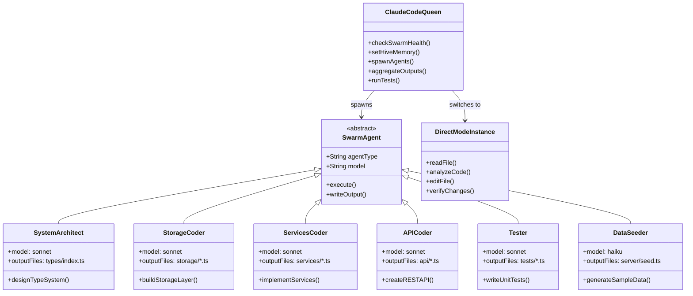
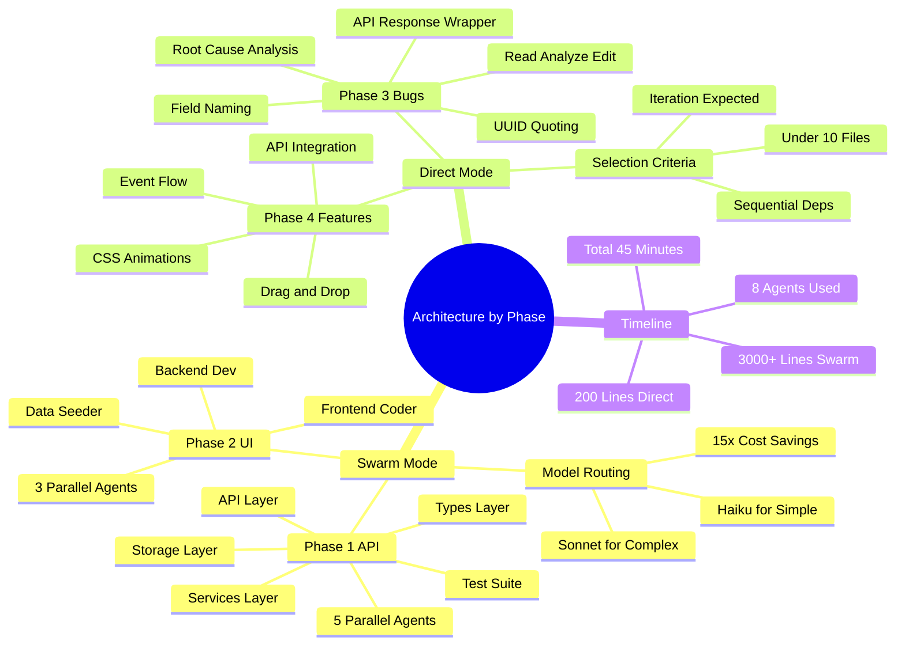
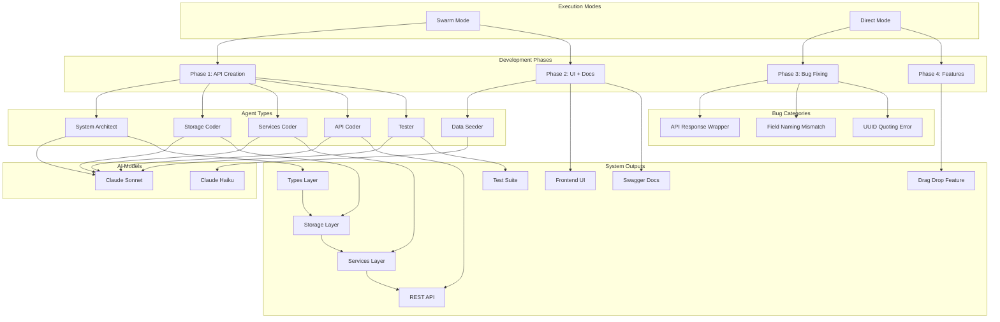

[🏠 Home](../../../../../README.md) / [LinkedIn Published](../../../../README.md) / [GenAI Development](../../../README.md) / [Claude Flow](../../README.md) / [CRM Hive-Mind Series](../README.md) / [Architecture by Phase](./README.md) / **Semantic Graph**

# Semantic Knowledge Graph: Architecture by Phase

---

## Summary

This document presents comprehensive technical architecture diagrams for a four-phase CRM development project using Claude-Flow. It demonstrates the strategic use of swarm execution mode with parallel agents for greenfield development (Phases 1-2) versus direct mode with single-instance Claude for bug fixes and small features (Phases 3-4). The architecture includes intelligent model routing, with Sonnet used for complex tasks and Haiku for simple operations, achieving optimal cost-effectiveness while maintaining development velocity.

---

## Key Concepts

1. **Phase-Based Development Timeline**: A structured four-phase approach dividing CRM development into API creation, UI/documentation, bug fixing, and feature enhancement, each with appropriate execution strategies.

2. **Swarm vs Direct Mode Selection**: Decision criteria for choosing between parallel agent swarm execution (10+ files, parallelizable tasks) and single-instance direct mode (bug fixes, sequential dependencies, iteration required).

3. **Parallel Agent Architecture**: Claude-Flow swarm topology where a Queen coordinator spawns multiple specialized agents (Architect, Coder, Tester) working simultaneously on different system components.

4. **Intelligent Model Routing**: Task complexity assessment that routes high-complexity work to Sonnet and simple tasks like data seeding to Haiku, achieving 15x cost reduction on appropriate workloads.

5. **Drag-and-Drop Event Flow**: Implementation architecture showing the browser event sequence from dragstart through drop, including API integration for deal stage updates.

6. **Bug Fix Root Cause Analysis**: Systematic debugging methodology addressing API response wrapper mismatches, field naming conventions (camelCase vs snake_case), and UUID quoting in HTML attributes.

---

## Core Arguments

1. **Execution mode should match task characteristics**: Swarm mode excels at greenfield parallel development (generating 3,000+ lines across 8 agents in 25 minutes), while direct mode provides the immediate feedback loops necessary for bug fixes and iterative feature work.

2. **Agent specialization improves output quality**: Dedicated agent types (system-architect, coder, tester) with appropriate models produce higher-quality code than generalist approaches, with the Queen aggregating and verifying all outputs.

3. **Model selection impacts cost without sacrificing quality**: Using Haiku for simple data seeding tasks (0.0002 USD/task) versus Sonnet for complex UI/backend work (0.003 USD/task) optimizes the cost-quality tradeoff.

4. **Sequential dependencies require direct mode**: Features like drag-and-drop where JavaScript events, CSS styles, and HTML structure are interconnected benefit from single-instance execution that can iterate quickly based on testing feedback.

5. **Parallel execution accelerates greenfield development**: Five agents completing API creation in 10 minutes demonstrates how swarm architecture compresses development timelines for independent workstreams.

6. **Clear handoff points between phases**: Each phase produces well-defined outputs (types, storage, services, API, tests) that subsequent phases can build upon, enabling clean separation of concerns.

---

## Tags

`claude-flow` `swarm-architecture` `parallel-agents` `direct-mode` `crm-development` `phase-based-development` `model-routing` `sonnet` `haiku` `drag-and-drop` `api-design` `bug-fixing` `root-cause-analysis` `typescript` `express-server`

---

## Mermaid Diagrams

### Development Phase Flowchart



### Agent Architecture Class Diagram



### Concept Mindmap



### Knowledge Graph



---

## Cypher Export

```cypher
// Execution Modes
CREATE (swarm:ExecutionMode {name: 'Swarm Mode', description: 'Parallel agent execution via Claude-Flow', bestFor: 'Greenfield development, 10+ files'})
CREATE (direct:ExecutionMode {name: 'Direct Mode', description: 'Single Claude instance with Edit tool', bestFor: 'Bug fixes, small features, iteration'})

// Development Phases
CREATE (p1:Phase {name: 'Phase 1: API Creation', duration: '10 min', outputLines: 1500, agentCount: 5})
CREATE (p2:Phase {name: 'Phase 2: UI + Docs', duration: '15 min', outputLines: 1500, agentCount: 3})
CREATE (p3:Phase {name: 'Phase 3: Bug Fixing', duration: '10 min', outputLines: 50, agentCount: 1})
CREATE (p4:Phase {name: 'Phase 4: Features', duration: '10 min', outputLines: 150, agentCount: 1})

// AI Models
CREATE (sonnet:Model {name: 'Claude Sonnet', costPerTask: 0.003, complexity: 'high'})
CREATE (haiku:Model {name: 'Claude Haiku', costPerTask: 0.0002, complexity: 'low'})

// Agent Types
CREATE (architect:AgentType {name: 'System Architect', task: 'Design type system', outputFiles: 'types/index.ts'})
CREATE (storageCoder:AgentType {name: 'Storage Coder', task: 'Build storage layer', outputFiles: 'storage/*.ts'})
CREATE (servicesCoder:AgentType {name: 'Services Coder', task: 'Implement services', outputFiles: 'services/*.ts'})
CREATE (apiCoder:AgentType {name: 'API Coder', task: 'Create REST API', outputFiles: 'api/*.ts'})
CREATE (tester:AgentType {name: 'Tester', task: 'Write unit tests', outputFiles: 'tests/*.ts'})
CREATE (seeder:AgentType {name: 'Data Seeder', task: 'Generate sample data', outputFiles: 'server/seed.ts'})

// System Components
CREATE (types:Component {name: 'Types Layer', entities: 6, includes: 'Customer, Deal, Contact, Interaction, Company, Note'})
CREATE (storage:Component {name: 'Storage Layer', pattern: 'Generic CRUD Map'})
CREATE (services:Component {name: 'Services Layer', includes: 'CustomerService, DealService, InteractionService'})
CREATE (api:Component {name: 'REST API', endpoints: 18})
CREATE (tests:Component {name: 'Test Suite', testCount: 40})
CREATE (ui:Component {name: 'Frontend UI', style: 'Modern SaaS'})
CREATE (swagger:Component {name: 'Swagger Docs', spec: 'OpenAPI 3.0'})

// Bug Fixes
CREATE (bug1:Bug {name: 'API Response Wrapper', rootCause: 'Frontend expected array, API returned wrapped object'})
CREATE (bug2:Bug {name: 'Field Naming Mismatch', rootCause: 'camelCase vs snake_case inconsistency'})
CREATE (bug3:Bug {name: 'UUID Quoting Error', rootCause: 'UUID in onclick interpreted as math expression'})

// Features
CREATE (dragdrop:Feature {name: 'Drag-and-Drop Pipeline', filesAffected: 4, events: 'dragstart, dragover, drop'})

// Relationships - Execution Mode to Phase
CREATE (swarm)-[:EXECUTES]->(p1)
CREATE (swarm)-[:EXECUTES]->(p2)
CREATE (direct)-[:EXECUTES]->(p3)
CREATE (direct)-[:EXECUTES]->(p4)

// Relationships - Phase to Agent
CREATE (p1)-[:USES_AGENT]->(architect)
CREATE (p1)-[:USES_AGENT]->(storageCoder)
CREATE (p1)-[:USES_AGENT]->(servicesCoder)
CREATE (p1)-[:USES_AGENT]->(apiCoder)
CREATE (p1)-[:USES_AGENT]->(tester)
CREATE (p2)-[:USES_AGENT]->(seeder)

// Relationships - Agent to Model
CREATE (architect)-[:RUNS_ON]->(sonnet)
CREATE (storageCoder)-[:RUNS_ON]->(sonnet)
CREATE (servicesCoder)-[:RUNS_ON]->(sonnet)
CREATE (apiCoder)-[:RUNS_ON]->(sonnet)
CREATE (tester)-[:RUNS_ON]->(sonnet)
CREATE (seeder)-[:RUNS_ON]->(haiku)

// Relationships - Agent to Component
CREATE (architect)-[:PRODUCES]->(types)
CREATE (storageCoder)-[:PRODUCES]->(storage)
CREATE (servicesCoder)-[:PRODUCES]->(services)
CREATE (apiCoder)-[:PRODUCES]->(api)
CREATE (tester)-[:PRODUCES]->(tests)

// Relationships - Component Dependencies
CREATE (storage)-[:DEPENDS_ON]->(types)
CREATE (services)-[:DEPENDS_ON]->(storage)
CREATE (api)-[:DEPENDS_ON]->(services)

// Relationships - Phase to Output
CREATE (p2)-[:PRODUCES]->(ui)
CREATE (p2)-[:PRODUCES]->(swagger)
CREATE (p3)-[:FIXES]->(bug1)
CREATE (p3)-[:FIXES]->(bug2)
CREATE (p3)-[:FIXES]->(bug3)
CREATE (p4)-[:IMPLEMENTS]->(dragdrop)

// Relationships - Phase Sequence
CREATE (p1)-[:FOLLOWED_BY]->(p2)
CREATE (p2)-[:FOLLOWED_BY]->(p3)
CREATE (p3)-[:FOLLOWED_BY]->(p4)
```

---

*Generated from source: 003-architecture-by-phase.md*
