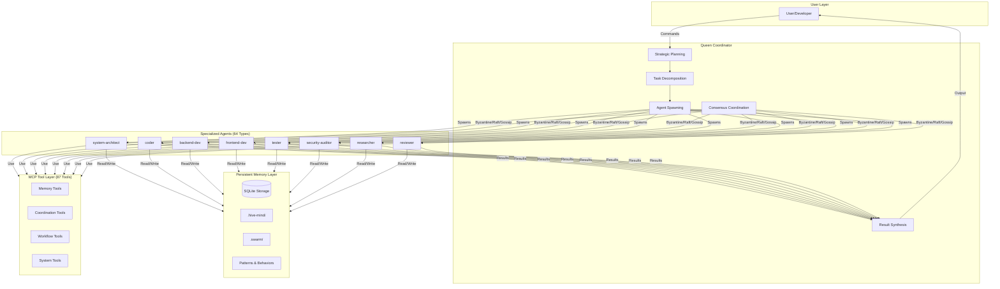
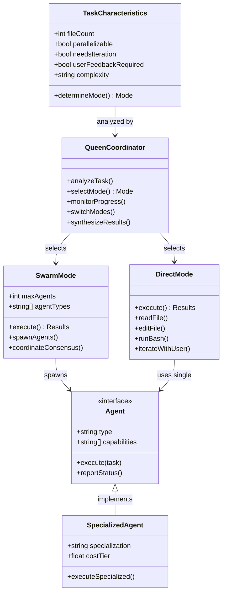
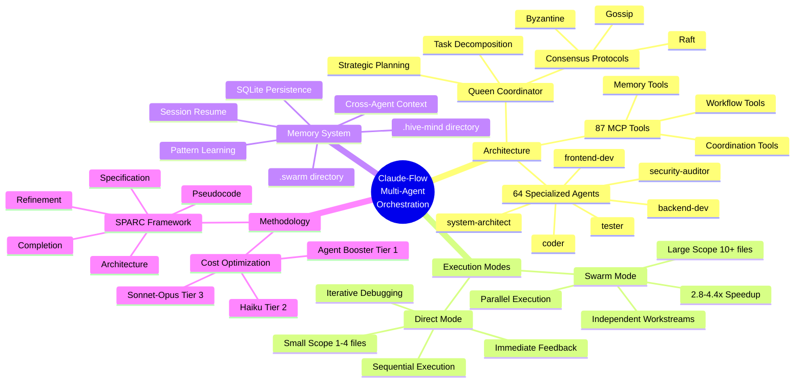
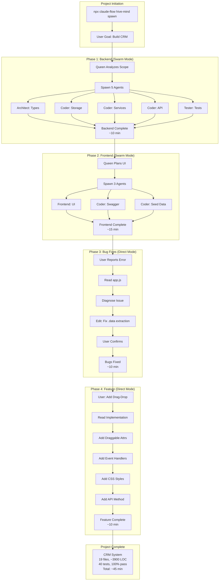

# Semantic Knowledge Graph: Claude-Flow vs Claude Code

[🏠 Home](../../../../../README.md) / [LinkedIn Published](../../../../README.md) / [GenAI Development](../../../README.md) / [Claude Flow](../../README.md) / [CRM Hive-Mind Series](../README.md) / [Claude-Flow vs Claude Code](./README.md) / **Semantic Graph**

---

## Summary

Claude-Flow represents a paradigm shift from single-model AI assistance to multi-agent orchestration, transforming Claude from an individual assistant into a coordinated team of 64 specialized agents. Through a CRM development case study, the analysis demonstrates that optimal AI-assisted development combines swarm mode (parallel execution via Claude-Flow) for large-scale work with direct mode (Claude Code) for precise iterative fixes. This hybrid approach achieved a complete CRM system in 45 minutes compared to an estimated 2-4 days using traditional methods, proving that intelligent orchestration of multiple models guided by human intent delivers superior results to either approach alone.

---

## Key Concepts

### 1. Multi-Agent Orchestration
The coordination of multiple specialized AI agents working in parallel under a Queen coordinator, enabling parallel task execution, distributed context, and specialized expertise for different aspects of development.

### 2. Swarm Mode vs Direct Mode
Two complementary operational approaches: swarm mode spawns multiple agents for parallel large-scale development (10+ files, independent workstreams), while direct mode uses single-threaded Claude Code for precise iterative fixes and debugging (1-4 files, tight coupling).

### 3. Queen Coordinator
The central intelligence in Claude-Flow's hive-mind architecture responsible for strategic planning, task decomposition, agent spawning, consensus coordination (Byzantine/Raft/Gossip protocols), result synthesis, and conflict resolution.

### 4. Persistent Memory Architecture
SQLite-backed memory system stored in `.hive-mind/` and `.swarm/` directories that enables session resumption, cross-agent context sharing, pattern learning, and institutional knowledge building across development sessions.

### 5. SPARC Methodology
Structured development approach: Specification, Pseudocode, Architecture, Refinement, Completion - providing a systematic framework for the 64 specialized agents to follow during parallel development.

### 6. Intelligent Model Routing
Cost optimization strategy using tiered model selection: Agent Booster for simple transforms ($0), Haiku for bug fixes ($0.0002), and Sonnet/Opus for complex reasoning ($0.003-$0.015).

---

## Core Arguments

### 1. Paradigm Shift from Assistant to Team
**Claim**: AI-assisted development fundamentally transforms when moving from single-model to multi-agent orchestration.
**Evidence**: Claude-Flow orchestrates 64 specialized agents in parallel versus sequential single-threaded processing, achieving 2.8-4.4x speed improvement and 84.8% SWE-Bench solve rate.

### 2. Complementary Rather Than Competing Approaches
**Claim**: Claude-Flow and Claude Code are collaborators, not competitors - the optimal approach uses both.
**Evidence**: CRM project used swarm mode for backend/frontend creation (25 min, 8 agents, 19 files) and direct mode for bug fixes and features (20 min, 15+ edits), demonstrating mode-switching based on task characteristics.

### 3. Human-in-the-Loop Maintains Control
**Claim**: Multi-agent AI development is intelligent augmentation, not full autonomy.
**Evidence**: Queen coordinator monitors progress, detects stuck agents, makes mode-switching decisions, synthesizes results, and intervenes directly for precision work.

### 4. Parallel Execution Delivers Order-of-Magnitude Speedup
**Claim**: Parallelizable development tasks achieve dramatic time reduction through concurrent agent execution.
**Evidence**: 45-minute total development time for complete CRM versus traditional estimate of 2-4 days; backend phase completed in 10 minutes with 5 parallel agents.

### 5. Persistent Memory Enables Institutional Learning
**Claim**: Session persistence and shared memory create compounding value across development sessions.
**Evidence**: SQLite storage enables session resume, cross-agent context sharing without token overhead, pattern learning from successes/failures, and agent specialization retention.

### 6. Right Tool for the Right Job
**Claim**: Task characteristics should determine execution mode selection.
**Evidence**: Decision matrix shows swarm mode optimal for large scope, parallelizable, specialized work; direct mode optimal for small changes, iterative debugging, user-feedback-dependent tasks.

---

## Tags

`multi-agent-systems` `ai-orchestration` `claude-flow` `claude-code` `parallel-execution` `swarm-intelligence` `hive-mind` `persistent-memory` `sparc-methodology` `consensus-protocols` `model-routing` `cost-optimization` `ai-development` `agent-specialization` `human-in-the-loop`

---

## Diagram 1: System Architecture (Flowchart)



---

## Diagram 2: Mode Selection Decision (Class Diagram)



---

## Diagram 3: Concept Hierarchy (Mind Map)



---

## Diagram 4: Development Workflow (Graph TB)



---

## Cypher Export

```cypher
// Nodes: Core Concepts
CREATE (cf:Platform {name: "Claude-Flow", type: "Multi-Agent Orchestration", agents: 64, tools: 87})
CREATE (cc:Tool {name: "Claude Code", type: "Single-Model CLI", provider: "Anthropic"})
CREATE (queen:Component {name: "Queen Coordinator", role: "Strategic Planning and Coordination"})
CREATE (swarm:Mode {name: "Swarm Mode", execution: "Parallel", bestFor: "Large features, parallel work"})
CREATE (direct:Mode {name: "Direct Mode", execution: "Sequential", bestFor: "Bug fixes, quick changes"})
CREATE (memory:System {name: "Persistent Memory", storage: "SQLite", directories: [".hive-mind", ".swarm"]})
CREATE (sparc:Methodology {name: "SPARC", phases: ["Specification", "Pseudocode", "Architecture", "Refinement", "Completion"]})

// Nodes: Agents
CREATE (architect:Agent {name: "system-architect", specialization: "Type systems, interfaces, design patterns"})
CREATE (coder:Agent {name: "coder", specialization: "Clean code, implementation, algorithms"})
CREATE (backend:Agent {name: "backend-dev", specialization: "Express, APIs, server configuration"})
CREATE (frontend:Agent {name: "frontend-dev", specialization: "UI development"})
CREATE (tester:Agent {name: "tester", specialization: "Test strategies, assertions, coverage"})
CREATE (security:Agent {name: "security-auditor", specialization: "Vulnerabilities, best practices"})

// Nodes: Consensus Protocols
CREATE (byzantine:Protocol {name: "Byzantine Consensus", type: "Fault-tolerant"})
CREATE (raft:Protocol {name: "Raft Consensus", type: "Leader-based"})
CREATE (gossip:Protocol {name: "Gossip Protocol", type: "Decentralized"})

// Nodes: Cost Tiers
CREATE (tier1:CostTier {name: "Agent Booster", cost: 0.0, useCase: "Simple transforms"})
CREATE (tier2:CostTier {name: "Haiku", cost: 0.0002, useCase: "Bug fixes, simple tasks"})
CREATE (tier3:CostTier {name: "Sonnet/Opus", cost: 0.015, useCase: "Architecture, complex reasoning"})

// Nodes: Metrics
CREATE (metrics:Performance {swebench: 84.8, tokenReduction: 32.3, speedup: "2.8-4.4x"})
CREATE (crm:Project {name: "CRM Case Study", duration: 45, files: 19, loc: 3900, tests: 40})

// Relationships: Platform Structure
CREATE (cf)-[:BUILT_ON]->(cc)
CREATE (cf)-[:CONTAINS]->(queen)
CREATE (cf)-[:PROVIDES]->(swarm)
CREATE (cf)-[:PROVIDES]->(direct)
CREATE (cf)-[:USES]->(memory)
CREATE (cf)-[:FOLLOWS]->(sparc)
CREATE (cf)-[:ACHIEVES]->(metrics)

// Relationships: Queen Coordination
CREATE (queen)-[:MANAGES]->(swarm)
CREATE (queen)-[:MANAGES]->(direct)
CREATE (queen)-[:SPAWNS]->(architect)
CREATE (queen)-[:SPAWNS]->(coder)
CREATE (queen)-[:SPAWNS]->(backend)
CREATE (queen)-[:SPAWNS]->(frontend)
CREATE (queen)-[:SPAWNS]->(tester)
CREATE (queen)-[:SPAWNS]->(security)
CREATE (queen)-[:COORDINATES_USING]->(byzantine)
CREATE (queen)-[:COORDINATES_USING]->(raft)
CREATE (queen)-[:COORDINATES_USING]->(gossip)

// Relationships: Agents and Memory
CREATE (architect)-[:READS_FROM]->(memory)
CREATE (architect)-[:WRITES_TO]->(memory)
CREATE (coder)-[:READS_FROM]->(memory)
CREATE (coder)-[:WRITES_TO]->(memory)
CREATE (backend)-[:READS_FROM]->(memory)
CREATE (tester)-[:READS_FROM]->(memory)

// Relationships: Mode Selection
CREATE (swarm)-[:OPTIMAL_FOR {scope: "10+ files", parallelizable: true}]->(crm)
CREATE (direct)-[:OPTIMAL_FOR {scope: "1-4 files", iterative: true}]->(crm)

// Relationships: Cost Optimization
CREATE (cf)-[:ROUTES_TO]->(tier1)
CREATE (cf)-[:ROUTES_TO]->(tier2)
CREATE (cf)-[:ROUTES_TO]->(tier3)

// Relationships: Case Study
CREATE (crm)-[:DEMONSTRATES]->(cf)
CREATE (crm)-[:USED]->(swarm)
CREATE (crm)-[:USED]->(direct)

// Queries for Analysis
// Find all agents and their specializations
// MATCH (a:Agent) RETURN a.name, a.specialization

// Find the execution path for large projects
// MATCH path = (cf:Platform)-[:PROVIDES]->(m:Mode)-[:OPTIMAL_FOR]->(p:Project)
// WHERE m.execution = "Parallel"
// RETURN path

// Compare modes
// MATCH (m:Mode) RETURN m.name, m.execution, m.bestFor
```

---

## Navigation

| Link | Path |
|------|------|
| Root | [../../../../../README.md](../../../../../README.md) |
| LinkedIn Published | [../../../../README.md](../../../../README.md) |
| GenAI Development | [../../../README.md](../../../README.md) |
| Claude Flow | [../../README.md](../../README.md) |
| CRM Hive-Mind Series | [../README.md](../README.md) |
| This Document | [./README.md](./README.md) |
