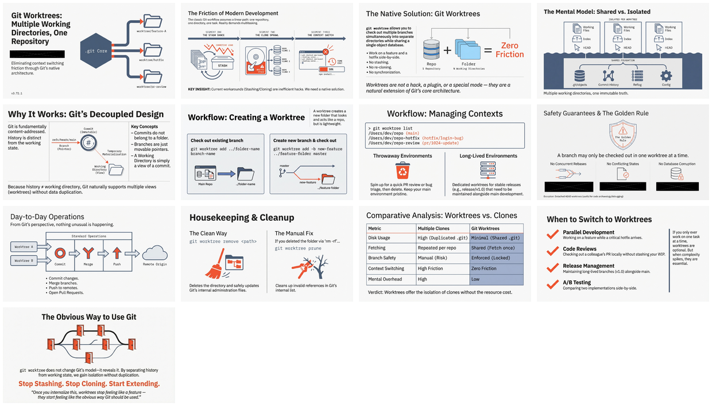

[🏠 Home](../../../../README.md) / [LinkedIn Published](../../README.md) / [GenAI Development](../README.md) / **Git Worktrees Zero-Friction Development**

---

# Git Worktrees: Multiple Working Directories, One Repository

A comprehensive guide to using `git worktree` for checking out multiple branches simultaneously into separate directories while sharing a single Git repository and object database — solving the multi-tasking bottleneck without stashing, context switching, or cloning.

| 📄 Source | 🖼️ Infographic | 📑 Slides |
|---|---|---|
| [Briefing (MD)](./v3.72.1__briefing__git_worktrees.md) | [View Image](./24%20Jan%20-%20Git%20Worktrees%20Multi-Tasking%20Bottleneck%20Solution.jpg) | [Slide Deck](./24%20Jan%20-%20Git_Worktrees_Zero_Friction_Development.pdf) |

> *Generated with [Google NotebookLM](https://notebooklm.google.com/) — Source document → Infographic → Slide deck*

---

## 🖼️ Infographic

---

## 📑 Slide Deck (13 slides)

*Click image to open the slide deck* · [⬇️ Download PDF](https://github.com/DinisCruz/NotebookLM__Infographics-and-slides/raw/refs/heads/main/linkedin-published/GenAI%20Development/Git%20Worktrees%20Zero-Friction%20Development/24%20Jan%20-%20Git_Worktrees_Zero_Friction_Development.pdf)

---

## 🧠 Semantic Knowledge Graph

> **Machine-readable metadata** — Structured content for search, discovery, and graph database integration

This document includes a comprehensive [SEMANTIC-GRAPH.md](./SEMANTIC-GRAPH.md) file containing:

| Section | Description |
|---------|-------------|
| Summary | 2-4 sentence overview of the content |
| Key Concepts | Core ideas with explanations |
| Core Arguments | Logical flow of main points |
| Mermaid Diagrams | Visual ontology, taxonomy, and knowledge graph |
| Neo4j Cypher | Ready-to-import graph database queries |

[📖 View SEMANTIC-GRAPH.md](./SEMANTIC-GRAPH.md)

---

## 🔗 LinkedIn Posts

| Type | Link |
|------|------|
| Slides Post | [View on LinkedIn](https://www.linkedin.com/feed/update/urn:li:ugcPost:7421019119778631680/) |

---

## Key Topics

| Topic | Description |
|-------|-------------|
| **Git Worktrees** | Feature allowing multiple checked-out branches in separate directories sharing one repository |
| **Shared Object Database** | All worktrees share commits, trees, blobs — only working state is isolated |
| **Branch Safety** | Git enforces one worktree per branch to prevent concurrent conflicts |
| **Zero Duplication** | Unlike multiple clones, worktrees share history with minimal disk overhead |
| **Context Switching** | Eliminates stash/pop cycles when working on multiple features simultaneously |

---

## Source Information

| Field | Value |
|-------|-------|
| **Version** | v3.72.1 |
| **Date** | January 2026 |
| **Topic** | Git development workflow optimization |
