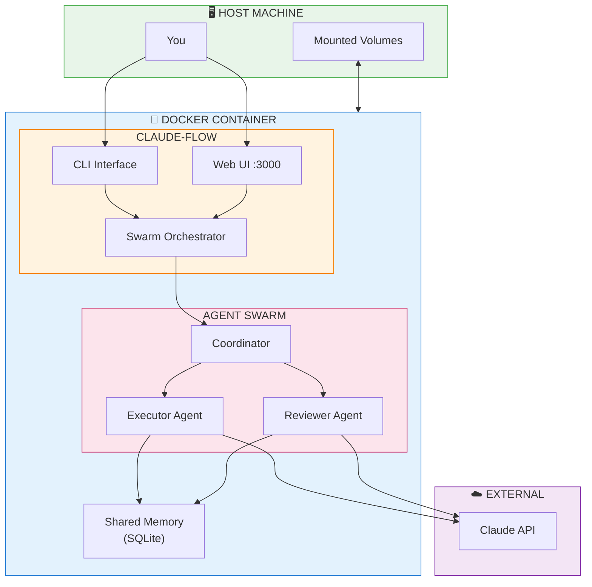
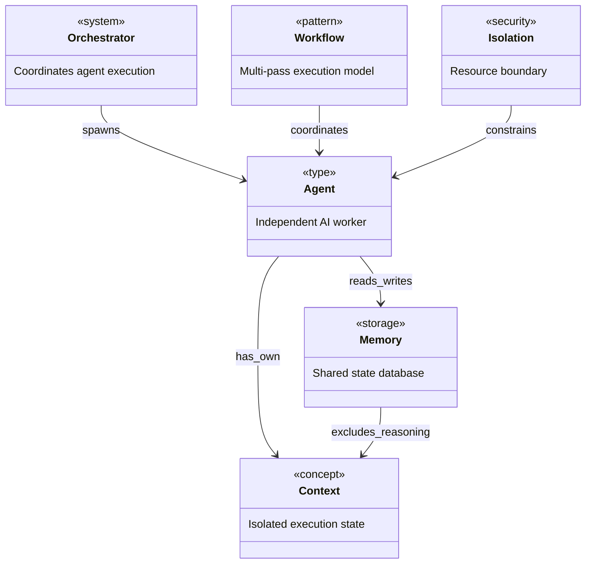
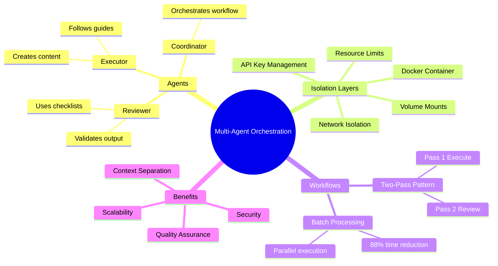
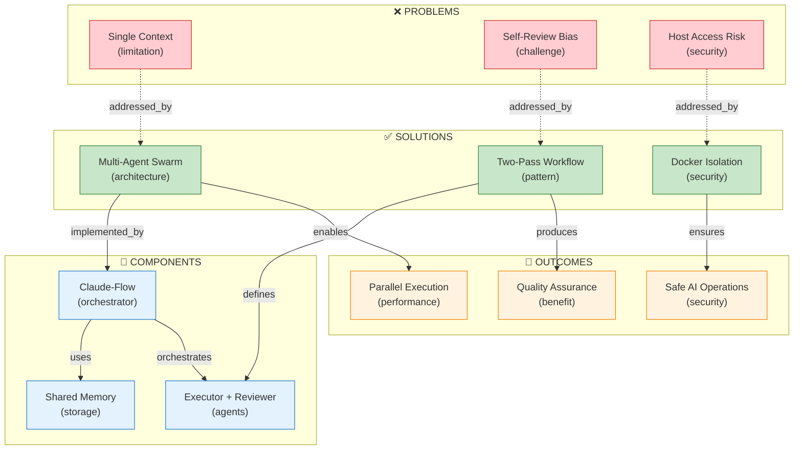

# Multi-Agent Orchestration with Claude-Flow in Docker

[📖 README](./README.md) · [🖼️ Infographic](./25%20Jan%20-%20Scaling%20AI%20Workflows%20via%20Claude-Flow.jpg) · [📑 Slides](./25%20Jan%20-%20Agent_Isolation_and_Quality_Control.pdf) · [🏠 Home](../../../../README.md) · [LinkedIn Published](../../README.md)

> *Semantic Knowledge Graph (SKG) — machine-readable metadata for search, discovery, and graph database integration*

---

## Summary

This document captures the design and implementation of a **multi-agent orchestration system** using Claude-Flow in an isolated Docker environment. It addresses fundamental limitations in Claude's consumer interfaces (Cowork/claude.ai) by enabling true parallel agent execution with separate contexts, genuine independent review (where the Reviewer doesn't know the Executor's reasoning), and complete isolation from the host system. The two-pass Executor/Reviewer pattern combined with Docker isolation provides a production-ready workflow for quality-assured content generation at scale.

---

## Key Concepts

- **Multi-Agent Swarm**: A coordinated group of specialized AI agents (Executor, Reviewer, Coordinator) that can run in parallel with separate contexts, orchestrated by Claude-Flow's swarm topology
- **Two-Pass Workflow**: A quality assurance pattern where Pass 1 (Executor) creates content following workflow guides, and Pass 2 (Reviewer) validates output against checklists with no knowledge of the Executor's reasoning
- **Self-Review Bias**: The problem where same-context review leads to unconscious bias because the reviewer knows why decisions were made and what edge cases were intentionally skipped
- **Docker Isolation**: A five-layer security model (container isolation, explicit volume mounts, network isolation, API key management, resource limits) that prevents AI agents from accessing host system resources
- **Shared Memory**: SQLite-based persistent storage (`.swarm/memory.db`) that allows agents to communicate through key-value pairs without sharing execution context
- **Context Separation**: The critical insight that independent review requires the Reviewer to only see the output file and checklist, not the Executor's reasoning process

---

## Core Arguments

1. Claude's consumer interfaces (Cowork/claude.ai) cannot spawn independent sub-agents — they operate in a single context window where the "Reviewer" knows everything the "Executor" thought
2. Self-review bias is a real quality problem: when the same context reviews its own work, it unconsciously passes because it remembers why each decision was made
3. True parallel execution with separate contexts requires external orchestration — Claude-Flow provides this through swarm topology and independent agent spawning
4. Docker isolation is essential for AI agent safety: agents should only access explicitly mounted volumes, not SSH keys, AWS credentials, or other host resources
5. The two-pass workflow pattern (Executor creates → Reviewer validates) catches errors that single-pass execution misses, especially for batch operations at scale
6. Batch parallel processing can achieve 88% time reduction compared to sequential processing (4 folders in ~25 seconds vs ~220 seconds)

---

## Key Quotes

> "Cannot spawn independent sub-agents — No parallel execution — Same context = same biases"

> "Reviewer sees: ALL OF THE ABOVE → Result: UNCONSCIOUS BIAS TO PASS"

> "Even if an agent 'goes rogue' or is manipulated: Cannot access your credentials, Cannot read other files"

> "This code has NO IDEA if cache is in-memory or remote — It just works!"

---

## Tags

`claude-flow` `multi-agent` `swarm` `docker` `isolation` `two-pass-workflow` `executor-reviewer` `quality-assurance` `parallel-execution` `context-separation` `ai-safety` `orchestration` `semantic-graph` `notebooklm` `content-validation`

---

## Search Phrases

- "how to run multiple Claude agents in parallel"
- "Claude executor reviewer workflow pattern"
- "Docker isolation for AI agents security"
- "self-review bias in AI content generation"
- "Claude-Flow swarm orchestration setup"
- "two-pass quality assurance for AI workflows"
- "separate context windows for AI validation"
- "batch processing with multi-agent swarms"
- "Claude Code vs Claude-Flow comparison"
- "AI agent isolation best practices"

---

## Semantic Knowledge Graph

### Multi-Agent Architecture (Visual)



### Ontology



### Taxonomy



### Knowledge Graph



### Cypher Import (Neo4j)

```cypher
// Create nodes - Problems
CREATE (single_context:Limitation {id: 'single_context', name: 'Single Context Window', description: 'Claude Cowork cannot spawn independent sub-agents'})
CREATE (self_review_bias:Challenge {id: 'self_review_bias', name: 'Self-Review Bias', description: 'Same context review leads to unconscious bias to pass'})
CREATE (host_access_risk:Security {id: 'host_access_risk', name: 'Host Access Risk', description: 'AI agents could access SSH keys, AWS credentials, etc.'})

// Create nodes - Solutions
CREATE (multi_agent_swarm:Architecture {id: 'multi_agent_swarm', name: 'Multi-Agent Swarm', description: 'Parallel execution with separate contexts'})
CREATE (two_pass_workflow:Pattern {id: 'two_pass_workflow', name: 'Two-Pass Workflow', description: 'Executor creates, Reviewer validates independently'})
CREATE (docker_isolation:Security {id: 'docker_isolation', name: 'Docker Isolation', description: 'Five-layer security boundary for AI agents'})

// Create nodes - Components
CREATE (claude_flow:Orchestrator {id: 'claude_flow', name: 'Claude-Flow', description: 'Swarm orchestration framework with Web UI'})
CREATE (shared_memory:Storage {id: 'shared_memory', name: 'Shared Memory', description: 'SQLite database for agent communication'})
CREATE (executor_agent:Agent {id: 'executor_agent', name: 'Executor Agent', description: 'Creates content following workflow guides'})
CREATE (reviewer_agent:Agent {id: 'reviewer_agent', name: 'Reviewer Agent', description: 'Validates output against checklists'})

// Create nodes - Outcomes
CREATE (quality_assurance:Benefit {id: 'quality_assurance', name: 'Quality Assurance', description: 'Catches errors single-pass execution misses'})
CREATE (parallel_execution:Performance {id: 'parallel_execution', name: 'Parallel Execution', description: '88% time reduction for batch processing'})
CREATE (safe_ai_operations:Security {id: 'safe_ai_operations', name: 'Safe AI Operations', description: 'Agents cannot access host credentials or files'})

// Create relationships - Problem solving
CREATE (single_context)-[:ADDRESSED_BY]->(multi_agent_swarm)
CREATE (self_review_bias)-[:ADDRESSED_BY]->(two_pass_workflow)
CREATE (host_access_risk)-[:ADDRESSED_BY]->(docker_isolation)

// Create relationships - Implementation
CREATE (multi_agent_swarm)-[:IMPLEMENTED_BY]->(claude_flow)
CREATE (claude_flow)-[:USES]->(shared_memory)
CREATE (claude_flow)-[:ORCHESTRATES]->(executor_agent)
CREATE (claude_flow)-[:ORCHESTRATES]->(reviewer_agent)
CREATE (two_pass_workflow)-[:DEFINES]->(executor_agent)
CREATE (two_pass_workflow)-[:DEFINES]->(reviewer_agent)

// Create relationships - Outcomes
CREATE (multi_agent_swarm)-[:ENABLES]->(parallel_execution)
CREATE (two_pass_workflow)-[:PRODUCES]->(quality_assurance)
CREATE (docker_isolation)-[:ENSURES]->(safe_ai_operations)
```

---

### Neo4j Visualization

**How to import and visualize this graph in Neo4j:**

1. **Create a free Neo4j Sandbox** at [sandbox.neo4j.com](https://sandbox.neo4j.com/) — select "Blank Sandbox"
2. **Open Neo4j Browser** and paste the Cypher code above into the query editor
3. **Run the query** (click the play button or press Ctrl+Enter)
4. **Visualize the graph** with this query:
   ```cypher
   MATCH p=()-[]-()
   RETURN p
   ```
