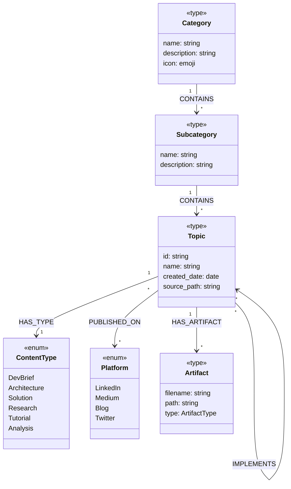

# NotebookLM Repository Ontology

> Defines the types of entities and relationships in this knowledge base

**Version**: 1.0
**Last Updated**: 31 January 2026

---

## Overview

This ontology defines the schema for organizing content in the NotebookLM Infographics & Slides repository. It establishes:
- **Node Types** — What kinds of things exist
- **Relationships** — How things connect
- **Properties** — What attributes things have

---

## Node Types

### Content Organization

| Type | Description | Examples |
|------|-------------|----------|
| `Category` | High-level domain of knowledge | GenAI, Cybersecurity, Graphs, Development, Meta |
| `Subcategory` | Division within a Category | Claude Skills, GDPR, Issue Tracking |
| `Topic` | Specific subject with associated content | Three-Layer Architecture, Graph-Based Issue Tracking |

### Content Classification

| Type | Description | Values |
|------|-------------|--------|
| `ContentType` | Format/maturity level of content | `DevBrief`, `Architecture`, `Solution`, `Research`, `Tutorial`, `Analysis` |
| `Platform` | Publication destination | `LinkedIn`, `Medium`, `Blog`, `Twitter` |
| `Status` | Publication status | `Draft`, `Published`, `Updated` |

### Artifacts (Files)

| Type | Description | Location |
|------|-------------|----------|
| `SourceDocument` | Original PDF or Markdown brief | `sources/` |
| `Infographic` | NotebookLM-generated image (JPG/PNG) | `sources/` |
| `SlidesDeck` | NotebookLM-generated slides (PDF) | `sources/` |
| `DeepResearch` | Extended research notes | `sources/` |
| `README` | Human navigation document | `topics/` |
| `SemanticGraph` | Machine-readable SKG (SEMANTIC-GRAPH.md) | `topics/` |
| `SlideMosaic` | 4x4 grid preview image | `topics/` |
| `PostText` | Published post content | `platforms/` |
| `PostLink` | Link to live post (webloc) | `platforms/` |

---

## Relationships

### Structural (Hierarchy)

```
Category ──CONTAINS──▶ Subcategory ──CONTAINS──▶ Topic
```

| Relationship | From | To | Cardinality |
|--------------|------|-----|-------------|
| `CONTAINS` | Category | Subcategory | 1:many |
| `CONTAINS` | Subcategory | Topic | 1:many |

### Content Typing

```
Topic ──HAS_TYPE──▶ ContentType
Topic ──HAS_ARTIFACT──▶ Artifact
```

| Relationship | From | To | Description |
|--------------|------|-----|-------------|
| `HAS_TYPE` | Topic | ContentType | Classifies content format |
| `HAS_ARTIFACT` | Topic | Artifact | Links to physical files |

### Cross-References (Topic to Topic)

| Relationship | Description | Example |
|--------------|-------------|---------|
| `RELATES_TO` | General association | PDD relates to Testing |
| `EXTENDS` | Elaborates/deepens | Architecture extends DevBrief |
| `IMPLEMENTS` | Realizes/builds | Solution implements Architecture |
| `SUPERSEDES` | Replaces older content | v2 supersedes v1 |
| `PART_OF` | Component of larger work | Chapter is part of Series |
| `CONTRASTS_WITH` | Alternative approach | TDD contrasts with PDD |

### Publication

```
Topic ──PUBLISHED_ON──▶ Platform
```

| Relationship | From | To | Properties |
|--------------|------|-----|------------|
| `PUBLISHED_ON` | Topic | Platform | published_date, post_url |

---

## Properties

### Category Properties

| Property | Type | Required | Description |
|----------|------|----------|-------------|
| `name` | string | yes | Display name |
| `description` | string | no | Brief explanation |
| `icon` | string | no | Emoji for visual identification |

### Topic Properties

| Property | Type | Required | Description |
|----------|------|----------|-------------|
| `id` | string | yes | Unique identifier (slug) |
| `name` | string | yes | Display name |
| `description` | string | no | One-line summary |
| `created_date` | date | yes | When source was created |
| `source_path` | string | yes | Path in sources/ |
| `content_type` | ContentType | yes | Format classification |
| `tags` | string[] | no | Search tags |

### Artifact Properties

| Property | Type | Required | Description |
|----------|------|----------|-------------|
| `filename` | string | yes | File name |
| `path` | string | yes | Full path from repo root |
| `type` | ArtifactType | yes | What kind of file |
| `size_bytes` | number | no | File size |

---

## Ontology Diagram



---

## Cypher Schema (Neo4j)

```cypher
// ============================================
// CONSTRAINTS (Uniqueness)
// ============================================

CREATE CONSTRAINT category_name IF NOT EXISTS
FOR (c:Category) REQUIRE c.name IS UNIQUE;

CREATE CONSTRAINT subcategory_id IF NOT EXISTS
FOR (s:Subcategory) REQUIRE s.id IS UNIQUE;

CREATE CONSTRAINT topic_id IF NOT EXISTS
FOR (t:Topic) REQUIRE t.id IS UNIQUE;

// ============================================
// INDEXES (Performance)
// ============================================

CREATE INDEX topic_type_idx IF NOT EXISTS
FOR (t:Topic) ON (t.content_type);

CREATE INDEX topic_date_idx IF NOT EXISTS
FOR (t:Topic) ON (t.created_date);

CREATE INDEX topic_category_idx IF NOT EXISTS
FOR (t:Topic) ON (t.category);

// ============================================
// ENUM-LIKE NODES
// ============================================

// Content Types
CREATE (ct_devbrief:ContentType {name: 'DevBrief', description: 'Technical brief or overview'})
CREATE (ct_architecture:ContentType {name: 'Architecture', description: 'System design document'})
CREATE (ct_solution:ContentType {name: 'Solution', description: 'Working implementation'})
CREATE (ct_research:ContentType {name: 'Research', description: 'Deep research report'})
CREATE (ct_tutorial:ContentType {name: 'Tutorial', description: 'How-to guide'})
CREATE (ct_analysis:ContentType {name: 'Analysis', description: 'Analytical breakdown'})

// Platforms
CREATE (p_linkedin:Platform {name: 'LinkedIn', url: 'https://linkedin.com'})
CREATE (p_medium:Platform {name: 'Medium', url: 'https://medium.com'})
CREATE (p_blog:Platform {name: 'Blog', url: 'TBD'})
CREATE (p_twitter:Platform {name: 'Twitter', url: 'https://twitter.com'})
```

---

## Usage Guidelines

### When to Update This Ontology

| Scenario | Action |
|----------|--------|
| New content fits existing types | No update needed |
| Need new Category | Add to TAXONOMY.md, update Cypher |
| Need new ContentType | Add to enum, update this file |
| Need new Relationship type | Add to relationships section |
| Need new Platform | Add to enum, update this file |

### Ontology Stability

The ontology should stabilize quickly:
- **Node Types**: Rarely change after initial definition
- **Relationships**: Occasionally extended for new patterns
- **Properties**: May grow as needs emerge

The **TAXONOMY.md** (actual categories) will change more frequently than this ontology (the schema).

---

## Related Documents

- [TAXONOMY.md](./TAXONOMY.md) — The actual category hierarchy
- [Three-Layer Architecture Brief](./sources/2026/01/31/Three-Layer-Content-Architecture/31-jan__brief__notebooklm-repo__exploring-new-content-stucture.md)
- [Ontology & Taxonomy Brief](./sources/2026/01/31/Repository-Ontology-and-Taxonomy/31-jan__brief__repo-level-ontology-and-taxonomy.md)
