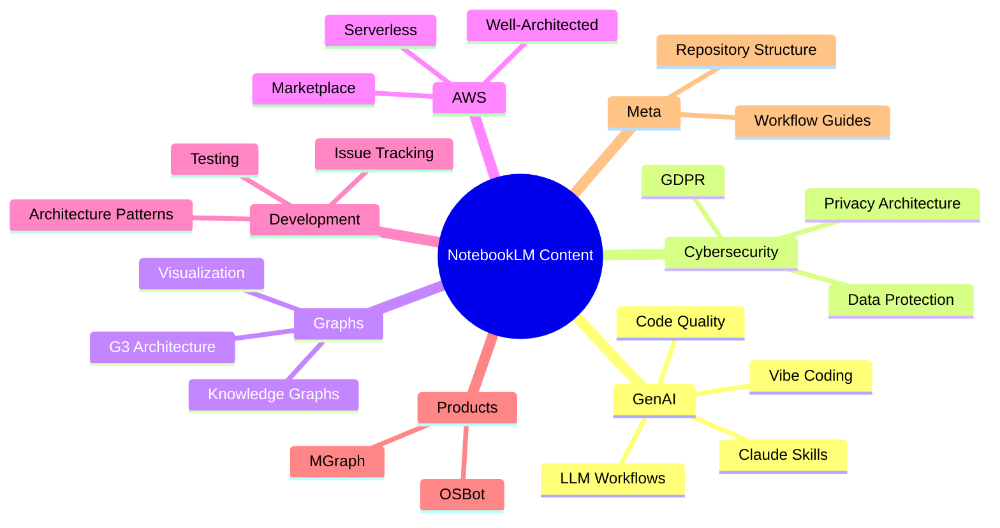

# NotebookLM Repository Taxonomy

> The category hierarchy for organizing content

**Version**: 1.0
**Last Updated**: 31 January 2026
**Total Categories**: 7
**Total Subcategories**: 15
**Total Topics**: 3 (initial)

---

## Visual Hierarchy



---

## Category Details

### GenAI

> AI-powered development practices, tools, and workflows

| Subcategory | Description | Topics |
|-------------|-------------|--------|
| Claude Skills | Building and using Claude skills | 0 |
| Code Quality | AI-era code quality practices | 0 |
| LLM Workflows | Patterns for LLM integration | 0 |
| Vibe Coding | Conversational/iterative development | 0 |

---

### Cybersecurity

> Security, privacy, compliance, and data protection

| Subcategory | Description | Topics |
|-------------|-------------|--------|
| GDPR | Data protection regulation | 0 |
| Privacy Architecture | Privacy-first system design | 0 |
| Data Protection | General data security | 0 |

---

### Graphs

> Graph technologies, knowledge graphs, and visualization

| Subcategory | Description | Topics |
|-------------|-------------|--------|
| Knowledge Graphs | SKGs, semantic modeling | 0 |
| G3 Architecture | Graphs of Graphs of Graphs | 0 |
| Visualization | Graph rendering and display | 0 |

---

### AWS

> Amazon Web Services patterns and practices

| Subcategory | Description | Topics |
|-------------|-------------|--------|
| Marketplace | AWS Marketplace publishing | 0 |
| Well-Architected | AWS Well-Architected Framework | 0 |
| Serverless | Serverless patterns | 0 |

---

### Development

> Software development practices and tooling

| Subcategory | Description | Topics |
|-------------|-------------|--------|
| Testing | TDD, PDD, test strategies | 0 |
| Architecture Patterns | Design patterns and approaches | 0 |
| Issue Tracking | Task and issue management | 1 |

**Topics in Development/Issue Tracking:**
- [Graph-Based Issue Tracking](./topics/Development/Issue%20Tracking/Graph-Based%20Issue%20Tracking/)

---

### Products

> Specific products, tools, and implementations

| Subcategory | Description | Topics |
|-------------|-------------|--------|
| MGraph | MGraph.ai products and services | 0 |
| OSBot | OSBot utilities and tools | 0 |

---

### Meta

> Content about this repository and its workflows

| Subcategory | Description | Topics |
|-------------|-------------|--------|
| Repository Structure | How this repo is organized | 2 |
| Workflow Guides | How to work with this repo | 0 |

**Topics in Meta/Repository Structure:**
- [Three-Layer Content Architecture](./topics/Meta/Repository%20Structure/Three-Layer%20Content%20Architecture/)
- [Repository Ontology and Taxonomy](./topics/Meta/Repository%20Structure/Repository%20Ontology%20and%20Taxonomy/)

---

## Content Type Distribution

| ContentType | Count | Description |
|-------------|-------|-------------|
| DevBrief | 3 | Technical briefs and overviews |
| Architecture | 0 | System design documents |
| Solution | 0 | Working implementations |
| Research | 0 | Deep research reports |
| Tutorial | 0 | How-to guides |

---

## Adding New Content

### Decision Tree

```
1. Does the Category exist?
   ├── YES → Go to step 2
   └── NO → Add Category to this file, then step 2

2. Does the Subcategory exist?
   ├── YES → Go to step 3
   └── NO → Add Subcategory under Category, then step 3

3. Create Topic folder in topics/[Category]/[Subcategory]/[Topic]/

4. Update this file with new Topic count
```

### Category Guidelines

- **Avoid massive categories** — Subcategorize when >15-20 topics
- **Follow natural ontology** — Group by domain concepts
- **Stay consistent** — Use same taxonomy in platforms/
- **Be specific enough** — But not so specific it's single-use

---

## Cypher Export

```cypher
// ============================================
// CATEGORIES
// ============================================

CREATE (genai:Category {
    name: 'GenAI',
    description: 'AI-powered development practices and workflows',
    icon: '🤖'
})

CREATE (cyber:Category {
    name: 'Cybersecurity',
    description: 'Security, privacy, and compliance',
    icon: '🔐'
})

CREATE (graphs:Category {
    name: 'Graphs',
    description: 'Graph technologies and visualization',
    icon: '🕸️'
})

CREATE (aws:Category {
    name: 'AWS',
    description: 'Amazon Web Services patterns',
    icon: '☁️'
})

CREATE (dev:Category {
    name: 'Development',
    description: 'Software development practices',
    icon: '💻'
})

CREATE (products:Category {
    name: 'Products',
    description: 'Specific products and tools',
    icon: '📦'
})

CREATE (meta:Category {
    name: 'Meta',
    description: 'Repository structure and workflows',
    icon: '🏗️'
})

// ============================================
// SUBCATEGORIES
// ============================================

// GenAI subcategories
CREATE (claude_skills:Subcategory {id: 'genai-claude-skills', name: 'Claude Skills'})
CREATE (code_quality:Subcategory {id: 'genai-code-quality', name: 'Code Quality'})
CREATE (llm_workflows:Subcategory {id: 'genai-llm-workflows', name: 'LLM Workflows'})
CREATE (vibe_coding:Subcategory {id: 'genai-vibe-coding', name: 'Vibe Coding'})

// Cybersecurity subcategories
CREATE (gdpr:Subcategory {id: 'cyber-gdpr', name: 'GDPR'})
CREATE (privacy_arch:Subcategory {id: 'cyber-privacy-arch', name: 'Privacy Architecture'})
CREATE (data_protection:Subcategory {id: 'cyber-data-protection', name: 'Data Protection'})

// Graphs subcategories
CREATE (knowledge_graphs:Subcategory {id: 'graphs-knowledge', name: 'Knowledge Graphs'})
CREATE (g3_arch:Subcategory {id: 'graphs-g3', name: 'G3 Architecture'})
CREATE (visualization:Subcategory {id: 'graphs-viz', name: 'Visualization'})

// AWS subcategories
CREATE (marketplace:Subcategory {id: 'aws-marketplace', name: 'Marketplace'})
CREATE (well_arch:Subcategory {id: 'aws-well-arch', name: 'Well-Architected'})
CREATE (serverless:Subcategory {id: 'aws-serverless', name: 'Serverless'})

// Development subcategories
CREATE (testing:Subcategory {id: 'dev-testing', name: 'Testing'})
CREATE (arch_patterns:Subcategory {id: 'dev-arch-patterns', name: 'Architecture Patterns'})
CREATE (issue_tracking:Subcategory {id: 'dev-issue-tracking', name: 'Issue Tracking'})

// Products subcategories
CREATE (mgraph:Subcategory {id: 'products-mgraph', name: 'MGraph'})
CREATE (osbot:Subcategory {id: 'products-osbot', name: 'OSBot'})

// Meta subcategories
CREATE (repo_structure:Subcategory {id: 'meta-repo-structure', name: 'Repository Structure'})
CREATE (workflow_guides:Subcategory {id: 'meta-workflows', name: 'Workflow Guides'})

// ============================================
// CATEGORY -> SUBCATEGORY RELATIONSHIPS
// ============================================

CREATE (genai)-[:CONTAINS]->(claude_skills)
CREATE (genai)-[:CONTAINS]->(code_quality)
CREATE (genai)-[:CONTAINS]->(llm_workflows)
CREATE (genai)-[:CONTAINS]->(vibe_coding)

CREATE (cyber)-[:CONTAINS]->(gdpr)
CREATE (cyber)-[:CONTAINS]->(privacy_arch)
CREATE (cyber)-[:CONTAINS]->(data_protection)

CREATE (graphs)-[:CONTAINS]->(knowledge_graphs)
CREATE (graphs)-[:CONTAINS]->(g3_arch)
CREATE (graphs)-[:CONTAINS]->(visualization)

CREATE (aws)-[:CONTAINS]->(marketplace)
CREATE (aws)-[:CONTAINS]->(well_arch)
CREATE (aws)-[:CONTAINS]->(serverless)

CREATE (dev)-[:CONTAINS]->(testing)
CREATE (dev)-[:CONTAINS]->(arch_patterns)
CREATE (dev)-[:CONTAINS]->(issue_tracking)

CREATE (products)-[:CONTAINS]->(mgraph)
CREATE (products)-[:CONTAINS]->(osbot)

CREATE (meta)-[:CONTAINS]->(repo_structure)
CREATE (meta)-[:CONTAINS]->(workflow_guides)

// ============================================
// TOPICS (Initial Set)
// ============================================

CREATE (topic_3layer:Topic {
    id: 'three-layer-content-architecture',
    name: 'Three-Layer Content Architecture',
    description: 'Separation of concerns: sources, topics, platforms',
    created_date: date('2026-01-31'),
    content_type: 'DevBrief',
    source_path: 'sources/2026/01/31/Three-Layer-Content-Architecture/'
})

CREATE (topic_ontology:Topic {
    id: 'repository-ontology-taxonomy',
    name: 'Repository Ontology and Taxonomy',
    description: 'Schema and hierarchy for repository organization',
    created_date: date('2026-01-31'),
    content_type: 'DevBrief',
    source_path: 'sources/2026/01/31/Repository-Ontology-and-Taxonomy/'
})

CREATE (topic_git_issues:Topic {
    id: 'graph-based-issue-tracking',
    name: 'Graph-Based Issue Tracking',
    description: 'Git-native issue tracking for AI agent coordination',
    created_date: date('2026-01-31'),
    content_type: 'DevBrief',
    source_path: 'sources/2026/01/31/Graph-Based-Issue-Tracking/'
})

// ============================================
// SUBCATEGORY -> TOPIC RELATIONSHIPS
// ============================================

CREATE (repo_structure)-[:CONTAINS]->(topic_3layer)
CREATE (repo_structure)-[:CONTAINS]->(topic_ontology)
CREATE (issue_tracking)-[:CONTAINS]->(topic_git_issues)

// ============================================
// TOPIC RELATIONSHIPS
// ============================================

CREATE (topic_ontology)-[:EXTENDS]->(topic_3layer)
```

---

## Related Documents

- [ONTOLOGY.md](./ONTOLOGY.md) — The schema definition
- `.claude/MAIN.md` — Repository context brief
