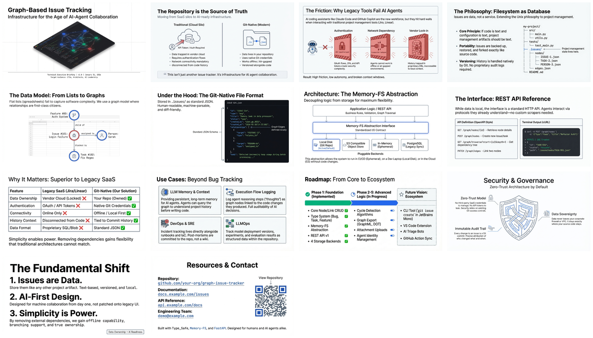

[🏠 Home](../../../../../README.md) / [semantic-data](../../../../README.md) / [Development](../../README.md) / [Issue Tracking](../README.md) / **Graph-Based Issue Tracking**

---

# Graph-Based Issue Tracking

Git-native issue tracking system that lives inside your repository — infrastructure for AI agent collaboration without external dependencies.

| 📄 Source | 🖼️ Infographic | 📑 Slides |
|-----------|----------------|-----------|
| [Technical Brief](../../../../sources/2026/01/31/Graph-Based-Issue-Tracking/v0.2.14__briefing__graph-based-issue-tracking.md) | [View Image](../../../../sources/2026/01/31/Graph-Based-Issue-Tracking/31%20Jan%20%20-%20Git-Native%20vs.%20Traditional%20Trackers.jpg) | [Slide Deck](../../../../sources/2026/01/31/Graph-Based-Issue-Tracking/31%20Jan-%20The_Repository_as_AI_Infrastructure.pdf) |

> *Generated with [Google NotebookLM](https://notebooklm.google.com/)*

---

## 🖼️ Infographic

---

## 📑 Slide Deck (14 slides)

*Click image to open slide deck*

---

## 🧠 Semantic Knowledge Graph

[📖 View SEMANTIC-GRAPH.md](./SEMANTIC-GRAPH.md)

---

## 📢 Published

- [LinkedIn Post](../../../../platforms/linkedin/Development/Issue%20Tracking/Graph-Based-Issue-Tracking/)

---

## Key Concepts

- **Git-Native** — Issues stored as JSON files in `.issues/` directory
- **No External Dependencies** — Works with git credentials, no API tokens
- **AI Agent Infrastructure** — Designed for Claude Code and similar agents
- **Versioned with Code** — Issue history is part of git history
- **Portable** — Works across any git host (GitHub, GitLab, etc.)
- **Graph Structure** — Issues, tasks, relationships all as connected nodes

---

## The Problem It Solves

When AI agents work on codebases, they need task management without:
- Authentication complexity (API tokens, OAuth)
- Vendor lock-in (proprietary databases)
- Network dependencies (offline capability)
- Rate limiting (API quotas)

**Solution**: Make the repository itself the source of truth for issues.

---

## Related Topics

- MGraph products (future)
- AI Agent Workflows (future)
