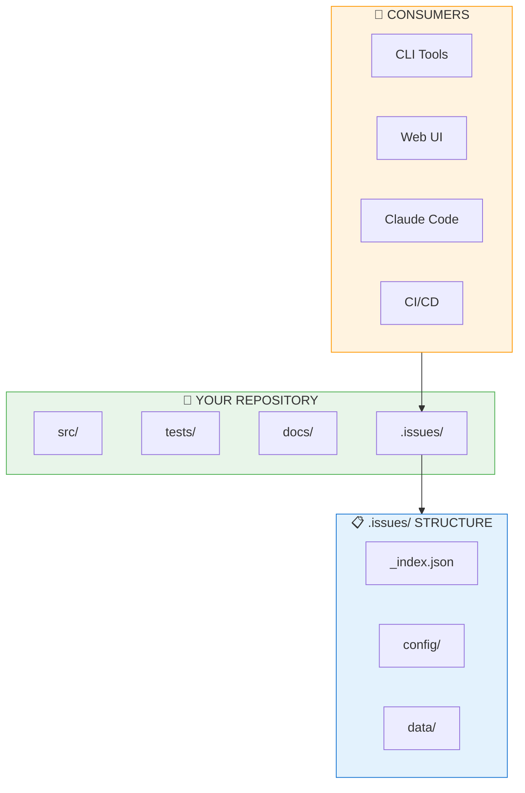
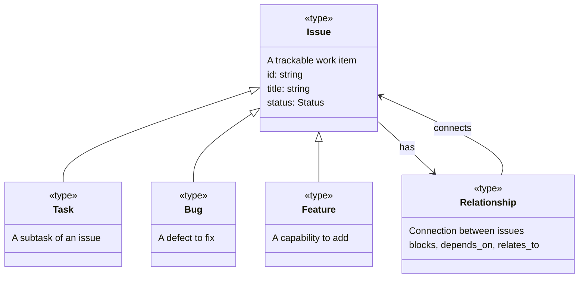
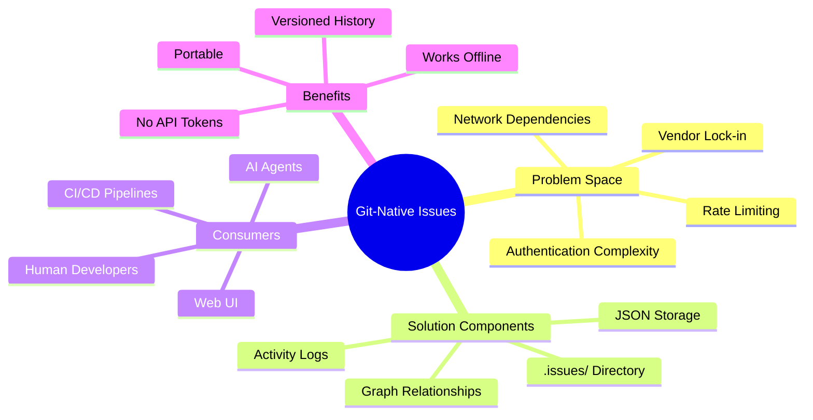
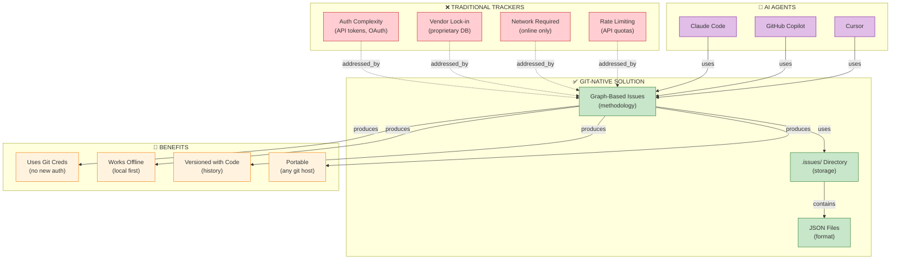

# Graph-Based Issue Tracking

[📖 README](./README.md) · [🖼️ Infographic](../../../../sources/2026/01/31/Graph-Based-Issue-Tracking/31%20Jan%20%20-%20Git-Native%20vs.%20Traditional%20Trackers.jpg) · [📑 Slides](../../../../sources/2026/01/31/Graph-Based-Issue-Tracking/31%20Jan-%20The_Repository_as_AI_Infrastructure.pdf) · [🏠 Home](../../../../../README.md)

> *Semantic Knowledge Graph (SKG) — machine-readable metadata for search, discovery, and graph database integration*

---

## Summary

A graph-based issue tracking system that lives inside your Git repository, eliminating external dependencies, authentication complexity, and vendor lock-in. Issues, tasks, relationships, and activity logs are stored as JSON files alongside your code — committed, versioned, and portable. This is infrastructure designed for AI agent collaboration.

---

## Key Concepts

- **Git-Native**: Issues stored in `.issues/` directory as JSON files, versioned with code
- **Zero External Dependencies**: Works with git credentials alone, no API tokens or OAuth
- **AI Agent Infrastructure**: Designed for Claude Code and similar agents to track work
- **Graph Structure**: Issues connect via typed relationships (blocks, depends-on, relates-to)
- **Portable**: Works across any git host — GitHub, GitLab, Bitbucket, self-hosted
- **Offline-Capable**: No network required to create, update, or query issues

---

## Core Arguments

1. AI agents need task management but traditional trackers introduce authentication complexity
2. Storing issues in the repository eliminates vendor lock-in and external dependencies
3. Git credentials already exist — no new authentication mechanism needed
4. Issue history versioned with code history enables powerful correlation
5. JSON files are simple, portable, and tool-agnostic
6. Graph structure enables rich relationships between issues, tasks, and code

---

## Key Quotes

> "This isn't just another issue tracker. It's infrastructure for AI agent collaboration."

> "When AI agents like Claude Code work on your codebase, they need a way to track tasks, report progress, and coordinate with humans and other agents."

> "Make the repository itself the source of truth."

---

## Tags

`issue-tracking` `git-native` `ai-agents` `claude-code` `task-management` `graph-database` `json` `portable` `offline` `devops` `infrastructure` `collaboration`

---

## Search Phrases

- "git native issue tracking"
- "issue tracker without external dependencies"
- "AI agent task management"
- "store issues in git repository"
- "alternative to github issues"
- "portable issue tracking"
- "issue tracking for AI coding assistants"

---

## Semantic Knowledge Graph

### System Architecture (Visual)



### Ontology



### Taxonomy



### Knowledge Graph



### Cypher Import (Neo4j)

```cypher
// ============================================
// NODES
// ============================================

// The solution
CREATE (git_issues:Methodology {
    id: 'graph_based_issue_tracking',
    name: 'Graph-Based Issue Tracking',
    description: 'Git-native issue tracking for AI agent coordination'
})

// Components
CREATE (issues_dir:Component {id: 'issues_dir', name: '.issues/ Directory'})
CREATE (json_storage:Component {id: 'json_storage', name: 'JSON File Storage'})
CREATE (graph_relationships:Component {id: 'graph_rel', name: 'Graph Relationships'})

// Problems solved
CREATE (auth_complexity:Challenge {id: 'auth', name: 'Authentication Complexity'})
CREATE (vendor_lockin:Challenge {id: 'lockin', name: 'Vendor Lock-in'})
CREATE (network_required:Challenge {id: 'network', name: 'Network Dependencies'})
CREATE (rate_limiting:Challenge {id: 'ratelimit', name: 'Rate Limiting'})

// Benefits
CREATE (git_creds:Benefit {id: 'git_creds', name: 'Uses Git Credentials'})
CREATE (offline:Benefit {id: 'offline', name: 'Works Offline'})
CREATE (versioned:Benefit {id: 'versioned', name: 'Versioned with Code'})
CREATE (portable:Benefit {id: 'portable', name: 'Portable Across Hosts'})

// AI Agents
CREATE (claude_code:Agent {id: 'claude_code', name: 'Claude Code'})
CREATE (copilot:Agent {id: 'copilot', name: 'GitHub Copilot'})
CREATE (cursor:Agent {id: 'cursor', name: 'Cursor'})

// ============================================
// RELATIONSHIPS
// ============================================

CREATE (git_issues)-[:USES]->(issues_dir)
CREATE (git_issues)-[:USES]->(json_storage)
CREATE (git_issues)-[:USES]->(graph_relationships)

CREATE (git_issues)-[:ADDRESSES]->(auth_complexity)
CREATE (git_issues)-[:ADDRESSES]->(vendor_lockin)
CREATE (git_issues)-[:ADDRESSES]->(network_required)
CREATE (git_issues)-[:ADDRESSES]->(rate_limiting)

CREATE (git_issues)-[:PRODUCES]->(git_creds)
CREATE (git_issues)-[:PRODUCES]->(offline)
CREATE (git_issues)-[:PRODUCES]->(versioned)
CREATE (git_issues)-[:PRODUCES]->(portable)

CREATE (claude_code)-[:CAN_USE]->(git_issues)
CREATE (copilot)-[:CAN_USE]->(git_issues)
CREATE (cursor)-[:CAN_USE]->(git_issues)
```
