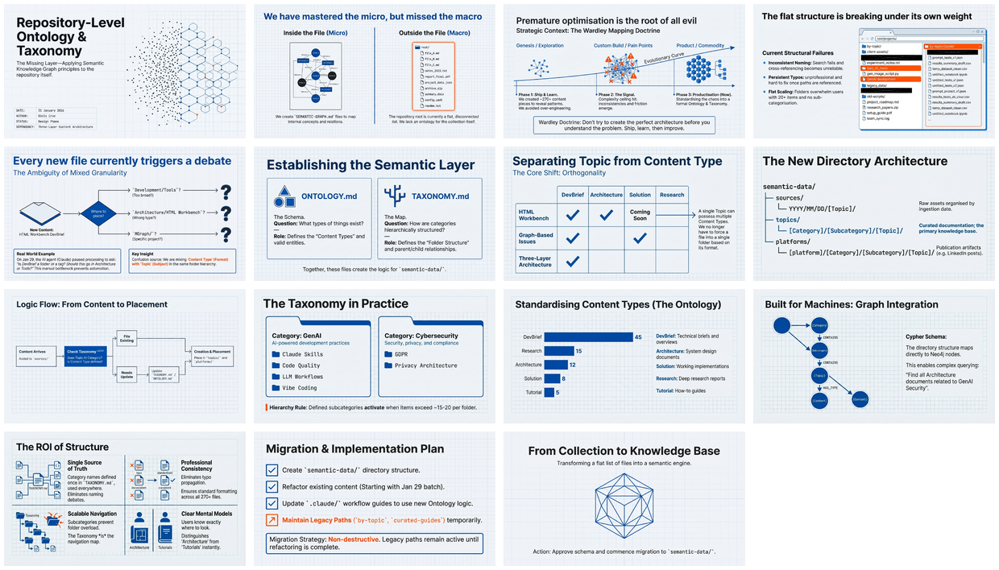

[🏠 Home](../../../../../README.md) / [semantic-data](../../../../README.md) / [Meta](../../README.md) / [Repository Structure](../README.md) / **Repository Ontology and Taxonomy**

---

# Repository Ontology and Taxonomy

Applying Semantic Knowledge Graph principles to the repository itself — defining what types of content exist (ontology) and how they're organized (taxonomy).

| 📄 Source | 🖼️ Infographic | 📑 Slides |
|-----------|----------------|-----------|
| [Ontology Brief](../../../../sources/2026/01/31/Repository-Ontology-and-Taxonomy/31-jan__brief__repo-level-ontology-and-taxonomy.md) | [View Image](../../../../sources/2026/01/31/Repository-Ontology-and-Taxonomy/31%20Jan%20-%20Scaling%20Knowledge%20via%20Ontology%20Layer.jpg) | [Slide Deck](../../../../sources/2026/01/31/Repository-Ontology-and-Taxonomy/31%20Jan%20-%20Repository_Ontology_and_Taxonomy_Redesign.pdf) |

> *Generated with [Google NotebookLM](https://notebooklm.google.com/)*

---

## 🖼️ Infographic

---

## 📑 Slide Deck (15 slides)

*Click image to open slide deck*

---

## 🧠 Semantic Knowledge Graph

[📖 View SEMANTIC-GRAPH.md](./SEMANTIC-GRAPH.md)

---

## 📢 Published

- [LinkedIn Post](../../../../platforms/linkedin/Meta/Repository%20Structure/Repository-Ontology-and-Taxonomy/)

---

## Key Concepts

- **Ontology** — Defines what types of things exist (Category, Subcategory, Topic, ContentType)
- **Taxonomy** — The actual hierarchy of categories and subcategories
- **Wardley Evolution** — Started simple, shipped, learned, now productizing
- **ContentType Dimension** — DevBrief, Architecture, Solution are orthogonal to Topic
- **Single Source of Truth** — One place defines valid categories

---

## Why This Matters

Before this ontology, adding new content required asking "where should this go?" — a human decision every time. Now:

1. Check TAXONOMY.md for existing categories
2. If fit exists → use it
3. If no fit → extend taxonomy first, then add content

This enables consistent categorization, scalable navigation, and future automation.

---

## Related Topics

- [Three-Layer Content Architecture](../Three-Layer-Content-Architecture/) — The structure this ontology powers
