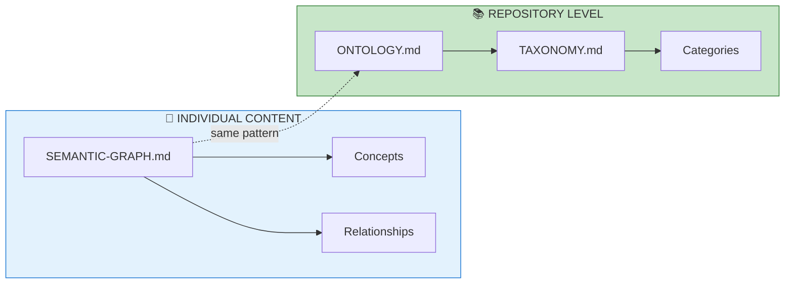
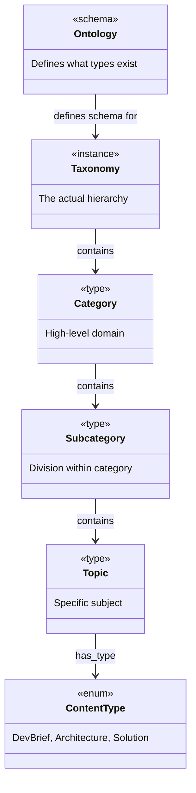
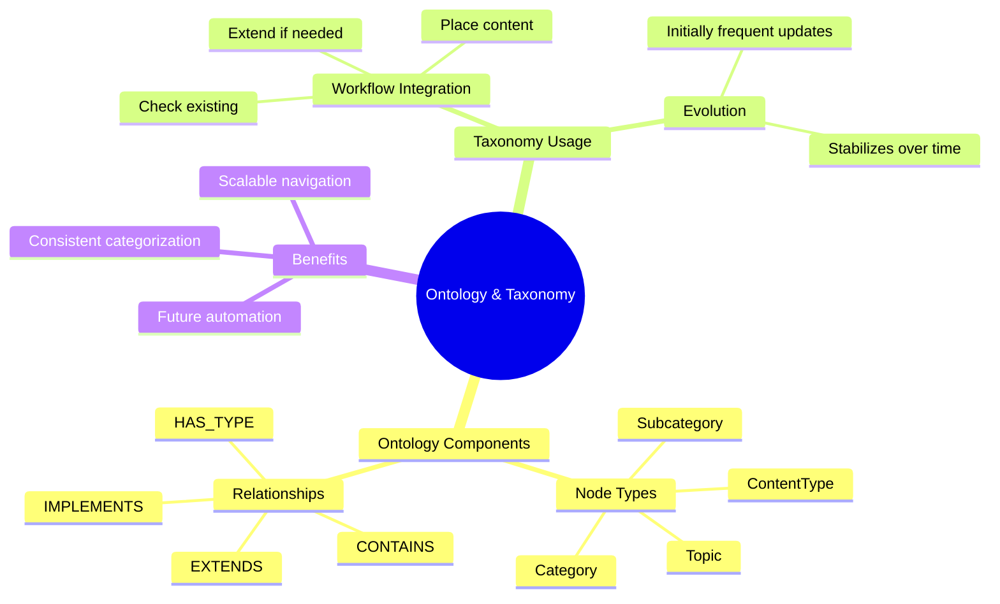
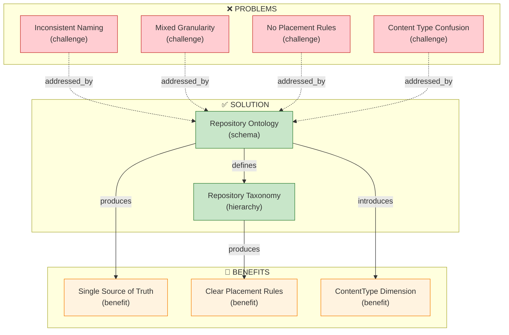

# Repository Ontology and Taxonomy

[📖 README](./README.md) · [🖼️ Infographic](../../../../sources/2026/01/31/Repository-Ontology-and-Taxonomy/31%20Jan%20-%20Scaling%20Knowledge%20via%20Ontology%20Layer.jpg) · [📑 Slides](../../../../sources/2026/01/31/Repository-Ontology-and-Taxonomy/31%20Jan%20-%20Repository_Ontology_and_Taxonomy_Redesign.pdf) · [🏠 Home](../../../../../README.md)

> *Semantic Knowledge Graph (SKG) — machine-readable metadata for search, discovery, and graph database integration*

---

## Summary

This document proposes a repository-level Ontology and Taxonomy for the NotebookLM repository. Just as individual content pieces have SEMANTIC-GRAPH.md files defining their knowledge structure, the repository itself needs a master schema defining how content is categorized, typed, and related. This follows Wardley Mapping doctrine: ship first, learn, then productize.

---

## Key Concepts

- **Ontology**: Defines what types of things exist (Category, Subcategory, Topic, ContentType, Platform)
- **Taxonomy**: The actual hierarchy of categories — the tree structure content lives in
- **ContentType Dimension**: Format/maturity (DevBrief, Architecture, Solution) is orthogonal to Topic
- **Wardley Evolution**: Started simple, shipped content, now productizing with structured schema
- **Taxonomy Stability**: Ontology stabilizes quickly; taxonomy evolves then stabilizes over time
- **Placement Rules**: Check taxonomy → find fit or extend → then place content

---

## Core Arguments

1. Individual SEMANTIC-GRAPH.md files prove the value of structured knowledge representation
2. The same pattern should apply at the repository level
3. Without an ontology, every new content piece requires a human decision on categorization
4. ContentType and Topic are orthogonal dimensions (same topic can have DevBrief + Architecture)
5. The taxonomy should evolve based on actual content, not be designed upfront
6. Following Wardley doctrine: don't over-engineer before understanding the problem

---

## Key Quotes

> "We've been creating SEMANTIC-GRAPH.md files for individual content, but we're missing the meta-level question: What's the ontology and taxonomy for THE WHOLE COLLECTION?"

> "Don't try to create the perfect architecture before you understand the problem. Ship something, learn from it, then improve."

---

## Tags

`ontology` `taxonomy` `knowledge-management` `semantic-graph` `wardley-mapping` `content-organization` `category-hierarchy` `metadata` `schema` `neo4j` `mermaid`

---

## Search Phrases

- "repository level ontology"
- "content taxonomy design"
- "how to categorize documentation"
- "knowledge base schema"
- "wardley mapping for content"
- "ontology vs taxonomy difference"
- "semantic knowledge graph for repository"

---

## Semantic Knowledge Graph

### Meta Pattern (Visual)



### Ontology



### Taxonomy



### Knowledge Graph



### Cypher Import (Neo4j)

```cypher
// ============================================
// NODES
// ============================================

// Core concepts
CREATE (ontology:Concept {
    id: 'ontology',
    name: 'Ontology',
    description: 'Defines what types of things exist'
})

CREATE (taxonomy:Concept {
    id: 'taxonomy',
    name: 'Taxonomy',
    description: 'The actual category hierarchy'
})

// Node types in the ontology
CREATE (category:NodeType {id: 'category', name: 'Category'})
CREATE (subcategory:NodeType {id: 'subcategory', name: 'Subcategory'})
CREATE (topic:NodeType {id: 'topic', name: 'Topic'})
CREATE (content_type:NodeType {id: 'content_type', name: 'ContentType'})

// Content type values
CREATE (devbrief:ContentTypeValue {id: 'devbrief', name: 'DevBrief'})
CREATE (architecture:ContentTypeValue {id: 'architecture', name: 'Architecture'})
CREATE (solution:ContentTypeValue {id: 'solution', name: 'Solution'})

// Benefits
CREATE (consistency:Benefit {id: 'consistency', name: 'Consistent Categorization'})
CREATE (scalability:Benefit {id: 'scalability', name: 'Scalable Navigation'})
CREATE (automation:Benefit {id: 'automation', name: 'Future Automation'})

// ============================================
// RELATIONSHIPS
// ============================================

CREATE (ontology)-[:DEFINES_SCHEMA_FOR]->(taxonomy)
CREATE (ontology)-[:INCLUDES]->(category)
CREATE (ontology)-[:INCLUDES]->(subcategory)
CREATE (ontology)-[:INCLUDES]->(topic)
CREATE (ontology)-[:INCLUDES]->(content_type)

CREATE (content_type)-[:HAS_VALUE]->(devbrief)
CREATE (content_type)-[:HAS_VALUE]->(architecture)
CREATE (content_type)-[:HAS_VALUE]->(solution)

CREATE (ontology)-[:ENABLES]->(consistency)
CREATE (taxonomy)-[:ENABLES]->(scalability)
CREATE (ontology)-[:ENABLES]->(automation)
```
