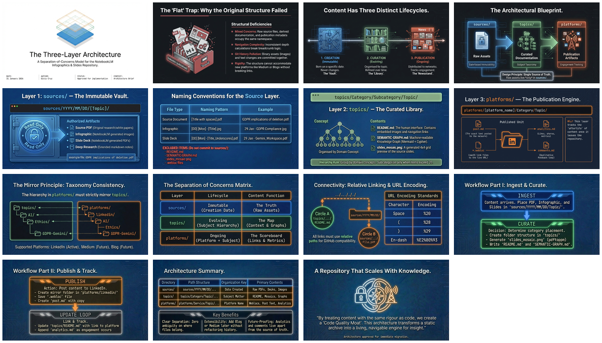

[🏠 Home](../../../../../README.md) / [semantic-data](../../../../README.md) / [Meta](../../README.md) / [Repository Structure](../README.md) / **Three-Layer Content Architecture**

---

# Three-Layer Content Architecture

A separation-of-concerns architecture for organizing content: **sources/** (raw assets by date), **topics/** (curated docs by category), and **platforms/** (publication artifacts).

| 📄 Source | 🖼️ Infographic | 📑 Slides |
|-----------|----------------|-----------|
| [Architecture Brief](../../../../sources/2026/01/31/Three-Layer-Content-Architecture/31-jan__brief__notebooklm-repo__exploring-new-content-stucture.md) | [View Image](../../../../sources/2026/01/31/Three-Layer-Content-Architecture/31%20Jan-%20Three-Layer%20Content%20Architecture%20Model.jpg) | [Slide Deck](../../../../sources/2026/01/31/Three-Layer-Content-Architecture/31%20Jan%20-%20Vault_Library_Newsstand_Model.pdf) |

> *Generated with [Google NotebookLM](https://notebooklm.google.com/)*

---

## 🖼️ Infographic

---

## 📑 Slide Deck (15 slides)

*Click image to open slide deck*

---

## 🧠 Semantic Knowledge Graph

[📖 View SEMANTIC-GRAPH.md](./SEMANTIC-GRAPH.md)

---

## 📢 Published

- [LinkedIn Post](../../../../platforms/linkedin/Meta/Repository%20Structure/Three-Layer-Content-Architecture/)

---

## Key Concepts

- **sources/** — Raw assets organized by creation date (YYYY/MM/DD/Topic/)
- **topics/** — Curated documentation organized by category hierarchy
- **platforms/** — Publication artifacts organized by platform and category
- **Separation of Concerns** — Each layer has one job
- **Single Source of Truth** — Assets live in sources/ only, referenced elsewhere
- **Relative Linking** — All links are relative paths for GitHub compatibility

---

## Related Topics

- [Repository Ontology and Taxonomy](../Repository-Ontology-and-Taxonomy/) — The schema that powers this structure
