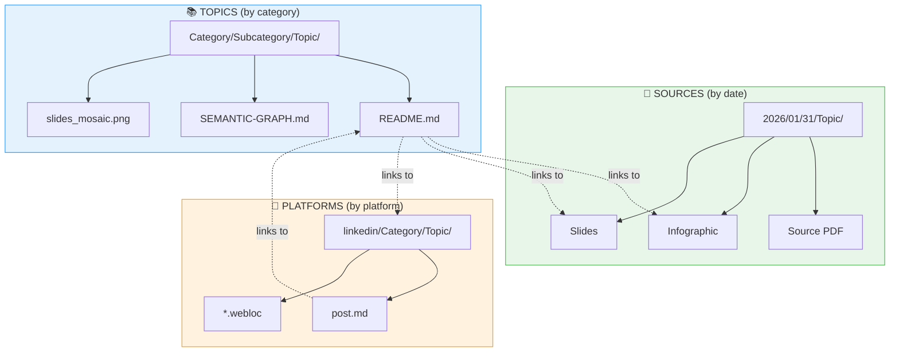
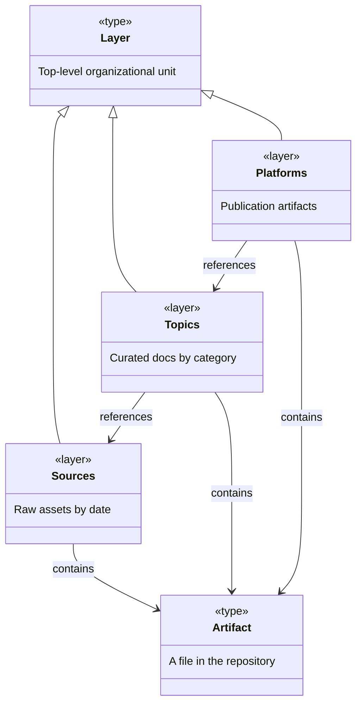
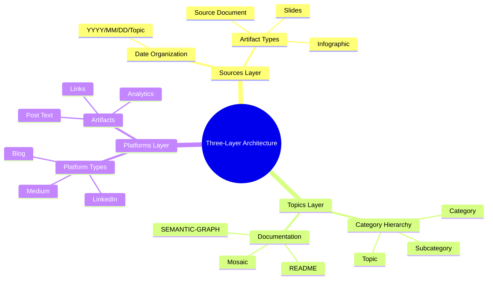
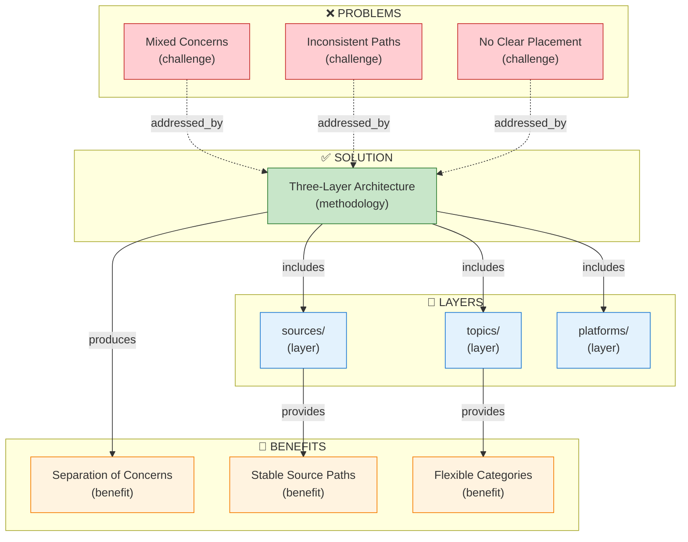

# Three-Layer Content Architecture

[📖 README](./README.md) · [🖼️ Infographic](../../../../sources/2026/01/31/Three-Layer-Content-Architecture/31%20Jan-%20Three-Layer%20Content%20Architecture%20Model.jpg) · [📑 Slides](../../../../sources/2026/01/31/Three-Layer-Content-Architecture/31%20Jan%20-%20Vault_Library_Newsstand_Model.pdf) · [🏠 Home](../../../../../README.md)

> *Semantic Knowledge Graph (SKG) — machine-readable metadata for search, discovery, and graph database integration*

---

## Summary

This document defines a three-layer architecture for organizing content in the NotebookLM repository: **sources/** for raw assets organized by date, **topics/** for curated documentation organized by category, and **platforms/** for publication artifacts. The architecture implements separation of concerns, enabling immutable source storage, flexible topic reorganization, and extensible platform support.

---

## Key Concepts

- **Separation of Concerns**: Each layer (sources/topics/platforms) has exactly one job, preventing mixed responsibilities
- **Single Source of Truth**: Raw assets live only in sources/, referenced by relative links elsewhere
- **Date Immutability**: Content creation dates don't change, providing stable source paths
- **Topic Flexibility**: Category hierarchy in topics/ can evolve without touching source files
- **Platform Extensibility**: New publication platforms added without restructuring existing content
- **Relative Linking**: All cross-layer links use relative paths for GitHub compatibility

---

## Core Arguments

1. Mixing source files, documentation, and publication artifacts in one folder creates maintenance chaos
2. Date-based organization for sources provides immutable, stable paths
3. Category-based organization for topics enables discovery and navigation
4. Platform-specific folders support different publication lifecycles
5. The three lifecycles (creation → curation → publication) map naturally to three layers
6. Relative links are the only format that works reliably on GitHub

---

## Key Quotes

> "Content in this repository has three distinct lifecycles: Creation, Curation, and Publication. These should map to three separate organizational structures."

> "Don't try to create the perfect architecture before you understand the problem. Ship something, learn from it, then improve."

---

## Tags

`architecture` `content-management` `separation-of-concerns` `repository-structure` `knowledge-management` `sources` `topics` `platforms` `relative-links` `github` `wardley-mapping` `evolution`

---

## Search Phrases

- "how to organize content repository"
- "separation of concerns for documentation"
- "three layer content architecture"
- "sources topics platforms structure"
- "managing notebooklm outputs"
- "date-based vs category-based organization"
- "github repository structure best practices"

---

## Semantic Knowledge Graph

### Architecture Diagram (Visual)



### Ontology



### Taxonomy



### Knowledge Graph



### Cypher Import (Neo4j)

```cypher
// ============================================
// NODES
// ============================================

// The methodology
CREATE (three_layer:Methodology {
    id: 'three_layer_architecture',
    name: 'Three-Layer Content Architecture',
    description: 'Separation of concerns: sources, topics, platforms'
})

// Layers
CREATE (sources:Layer {id: 'sources', name: 'sources/', organization: 'by date'})
CREATE (topics:Layer {id: 'topics', name: 'topics/', organization: 'by category'})
CREATE (platforms:Layer {id: 'platforms', name: 'platforms/', organization: 'by platform'})

// Problems addressed
CREATE (mixed_concerns:Challenge {id: 'mixed_concerns', name: 'Mixed Concerns'})
CREATE (inconsistent_paths:Challenge {id: 'inconsistent_paths', name: 'Inconsistent Paths'})
CREATE (no_placement:Challenge {id: 'no_placement', name: 'No Clear Placement Rules'})

// Benefits
CREATE (separation:Benefit {id: 'separation', name: 'Separation of Concerns'})
CREATE (stable_paths:Benefit {id: 'stable_paths', name: 'Stable Source Paths'})
CREATE (flexible_cats:Benefit {id: 'flexible_cats', name: 'Flexible Categories'})

// ============================================
// RELATIONSHIPS
// ============================================

CREATE (three_layer)-[:INCLUDES]->(sources)
CREATE (three_layer)-[:INCLUDES]->(topics)
CREATE (three_layer)-[:INCLUDES]->(platforms)

CREATE (three_layer)-[:ADDRESSES]->(mixed_concerns)
CREATE (three_layer)-[:ADDRESSES]->(inconsistent_paths)
CREATE (three_layer)-[:ADDRESSES]->(no_placement)

CREATE (three_layer)-[:PRODUCES]->(separation)
CREATE (sources)-[:PROVIDES]->(stable_paths)
CREATE (topics)-[:PROVIDES]->(flexible_cats)

CREATE (topics)-[:REFERENCES]->(sources)
CREATE (platforms)-[:REFERENCES]->(topics)
CREATE (platforms)-[:REFERENCES]->(sources)
```
